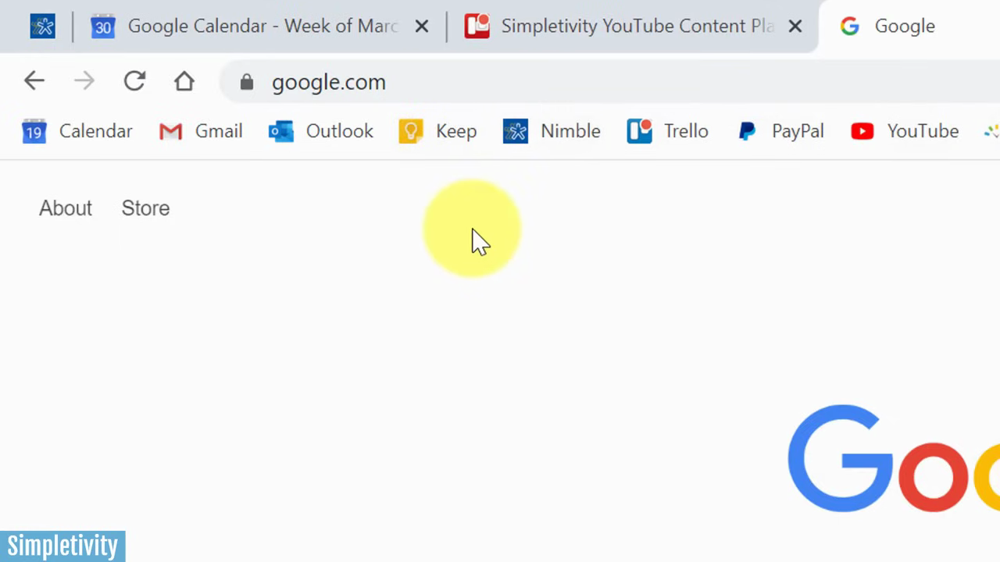
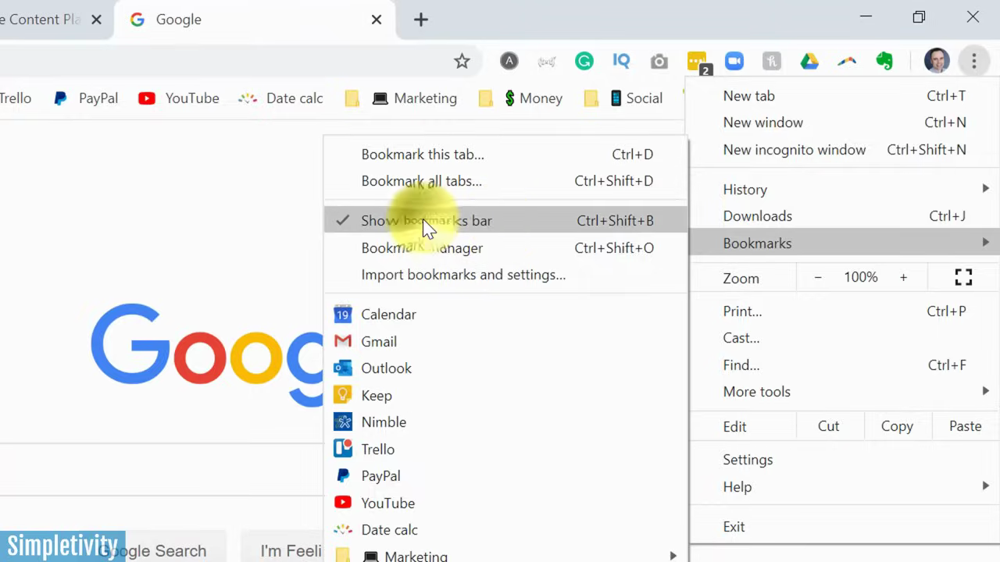
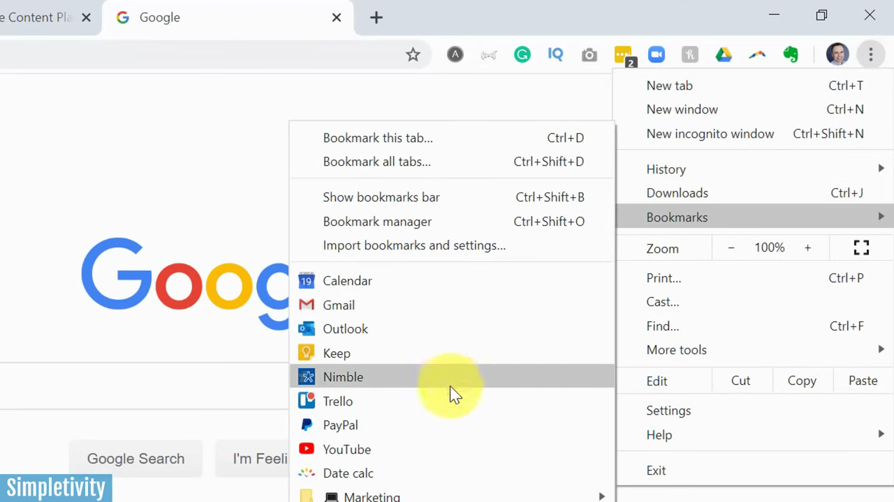
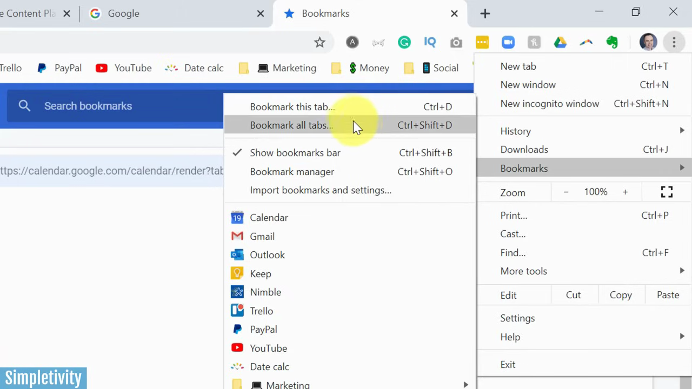

# Add a Bookmark

1. Navigate to the webpage you want to bookmark in Chrome
2. Click the star icon (☆) in the address bar, or press Ctrl+D (Windows) / Cmd+D (Mac) to bookmark the current tab

   

3. In the bookmark dialog that appears, edit the name of the bookmark if desired

   

4. Choose a folder destination for the bookmark using the folder dropdown, then click 'Done'

   

5. To show your bookmarks bar for quick access, go to the Chrome menu (⋮) > Bookmarks > Show bookmarks bar, or press Ctrl+Shift+B (Windows) / Cmd+Shift+B (Mac)

   

6. To bookmark all open tabs at once, go to the Chrome menu (⋮) > Bookmarks > Bookmark all tabs, or press Ctrl+Shift+D (Windows) / Cmd+Shift+D (Mac)

   
