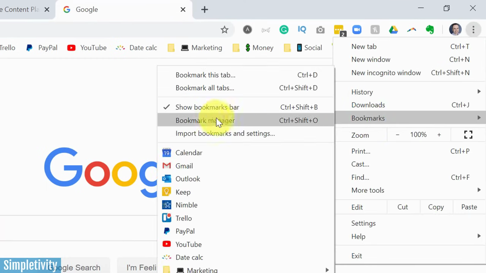
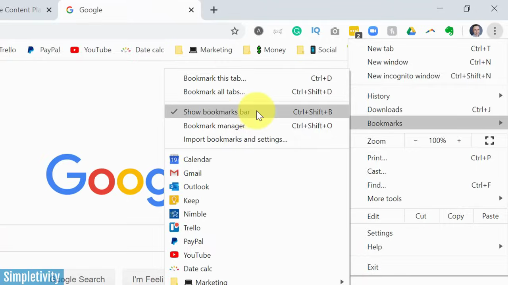
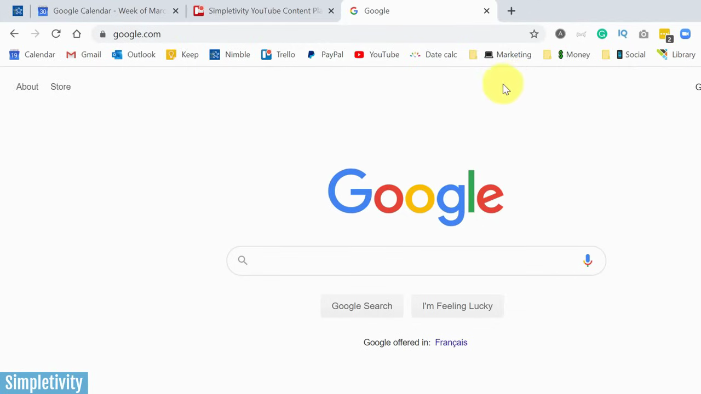
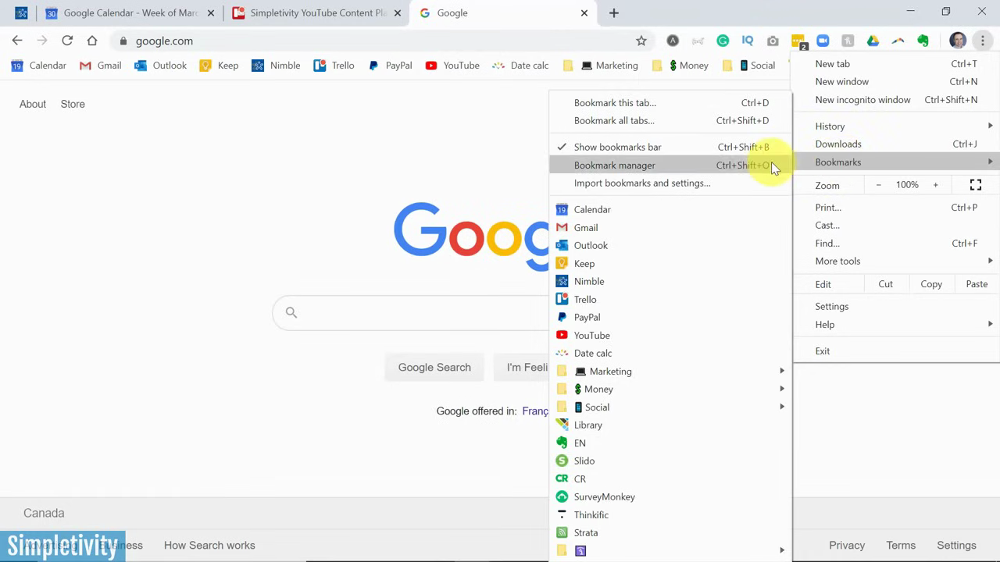
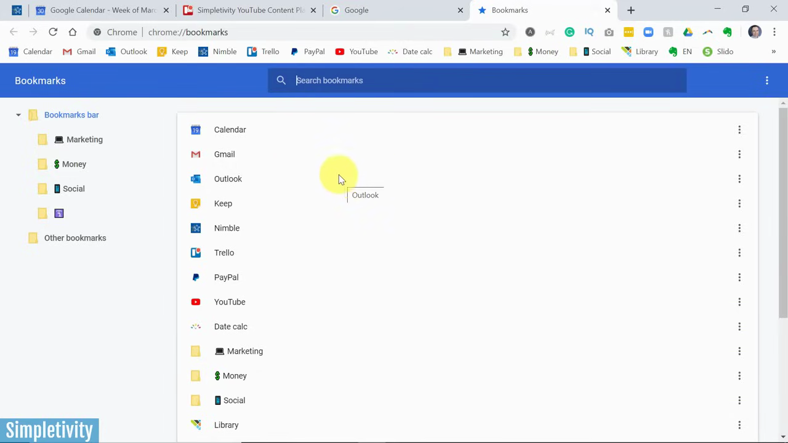
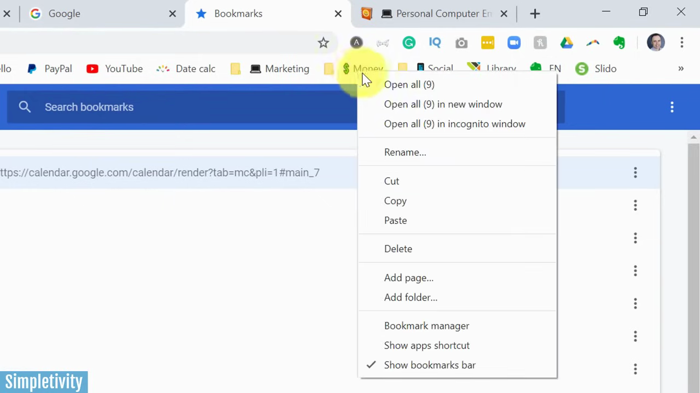

# Show Bookmark Bar

1. Click the three-dot menu (⋮) in the top-right corner of Chrome to open Settings.

   

2. Hover over 'Bookmarks' in the menu to expand the bookmarks submenu.

   

3. Click 'Show bookmarks bar' to toggle it on (a checkmark indicates it is enabled). You can also use the shortcut Ctrl+Shift+B (Windows) or Cmd+Shift+B (Mac).

   

4. To add the current page as a bookmark to the bar, click the star icon in the address bar or press Ctrl+D (Cmd+D on Mac), then set the folder to 'Bookmarks bar' and click 'Done'.

   

5. To organize bookmarks, open the Bookmark Manager by going to the three-dot menu > Bookmarks > 'Bookmark manager' (or press Ctrl+Shift+O / Cmd+Shift+O). Drag and drop items to reorder them.

   

6. In the Bookmark Manager, click the three-dot menu in the top-right corner of the manager and select 'Add new folder' to create a folder on the bookmarks bar.

   

7. Right-click any bookmark or folder on the bar and select 'Edit' or 'Rename' to shorten its label — removing the name entirely leaves only the favicon, saving space on the bar.

   
