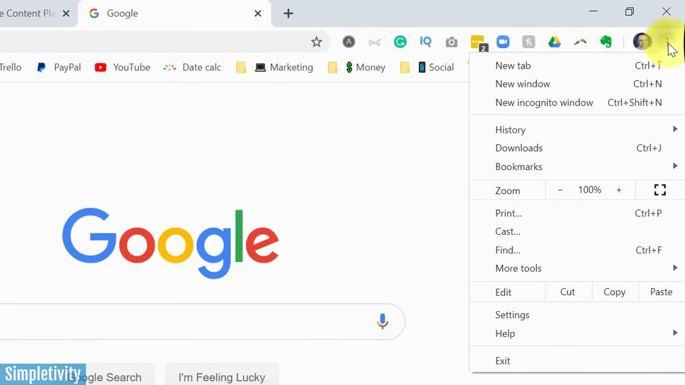
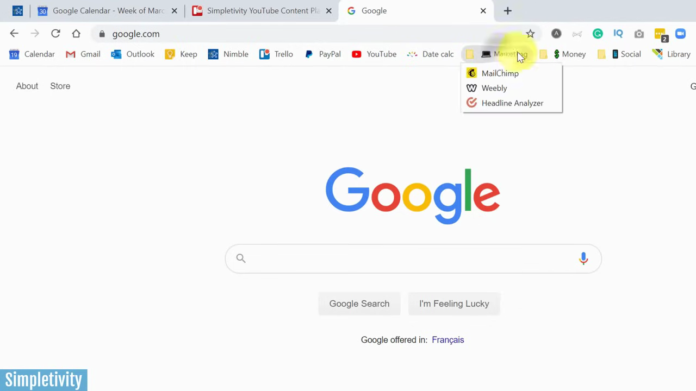
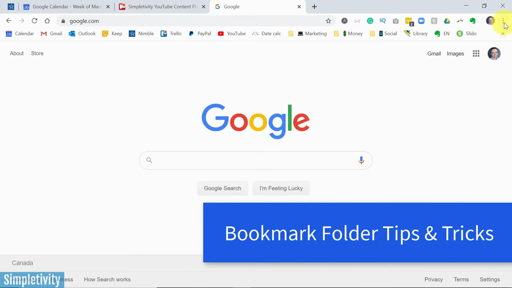
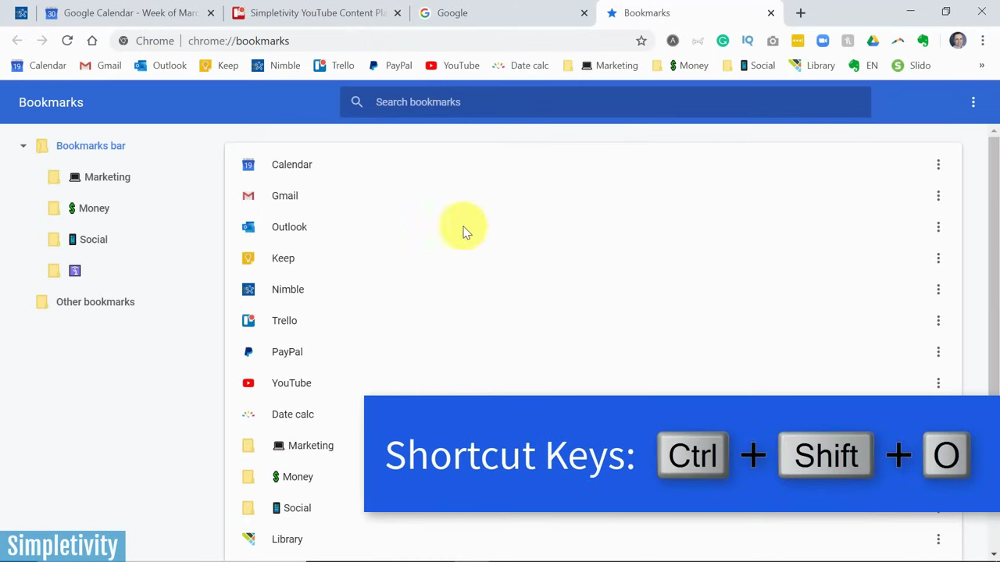
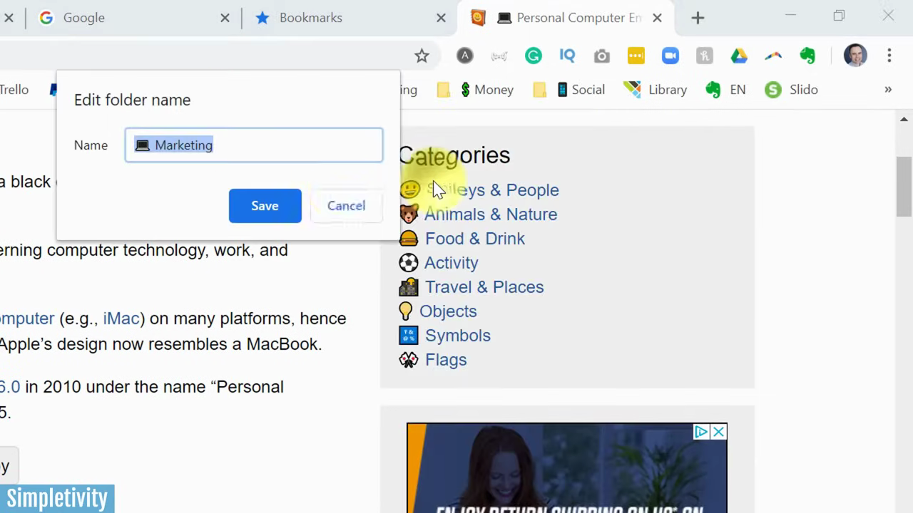
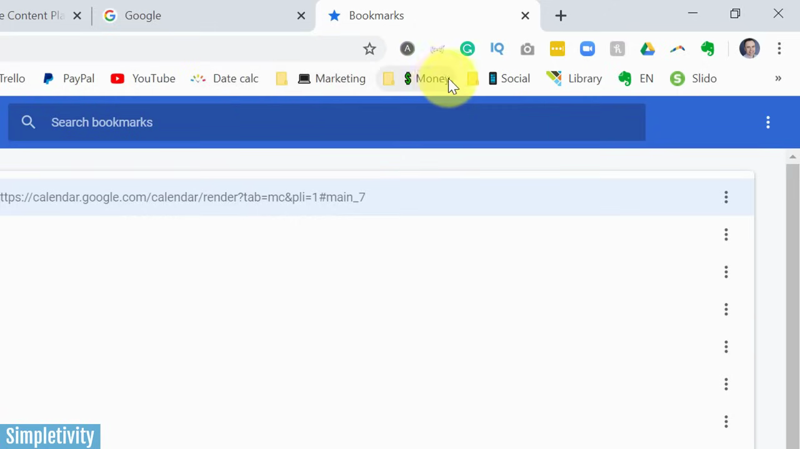
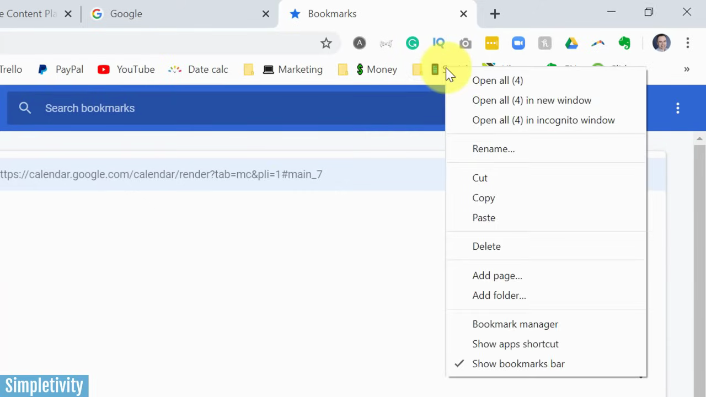

# Manage Bookmarks

1. Enable the bookmarks bar by clicking the three-dot menu, hovering over 'Bookmarks', and checking 'Show bookmarks bar'.

   

2. Open the Bookmark Manager by clicking the three-dot menu > Bookmarks > Bookmark manager (or press Ctrl+Shift+O).

   

3. In the Bookmark Manager, drag and drop bookmarks to reorder them, placing your most frequently visited sites in the first positions.

   

4. Create a new folder by clicking the three-dot icon in the top-right of the Bookmark Manager and selecting 'Add new folder', then type a name and save.

   

5. Rename a bookmark or folder by right-clicking it and selecting 'Rename' (for folders) or 'Edit' (for bookmarks), then type a shorter name to save space on the bookmarks bar.

   

6. Add an emoji to a folder name for quick visual identification: copy an emoji from a site like emojipedia.org, then right-click the folder, select 'Rename', and paste the emoji at the start of the name.

   

7. To open all bookmarks in a folder at once, right-click the folder on the bookmarks bar and select 'Open all'.

   

8. To remove a bookmark's text label entirely (keeping only its icon), right-click it, select 'Edit', delete the name field, and click 'Save'.
