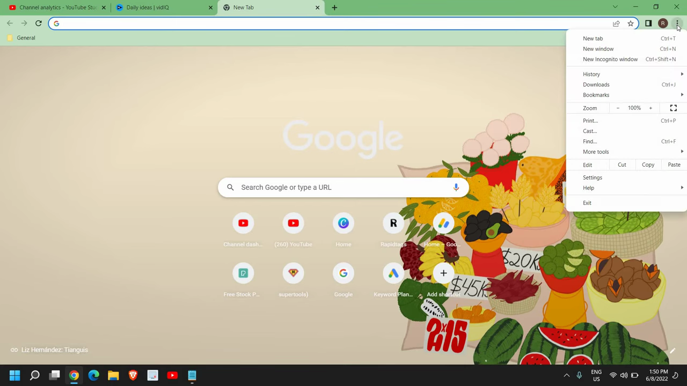
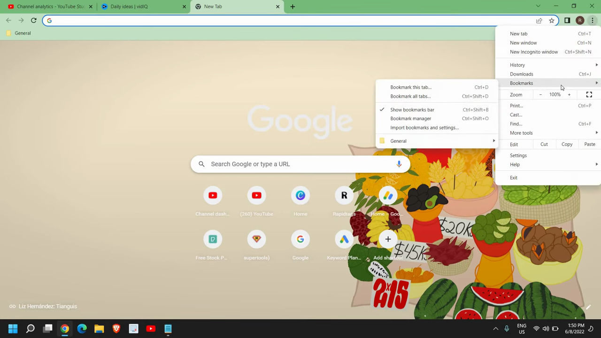
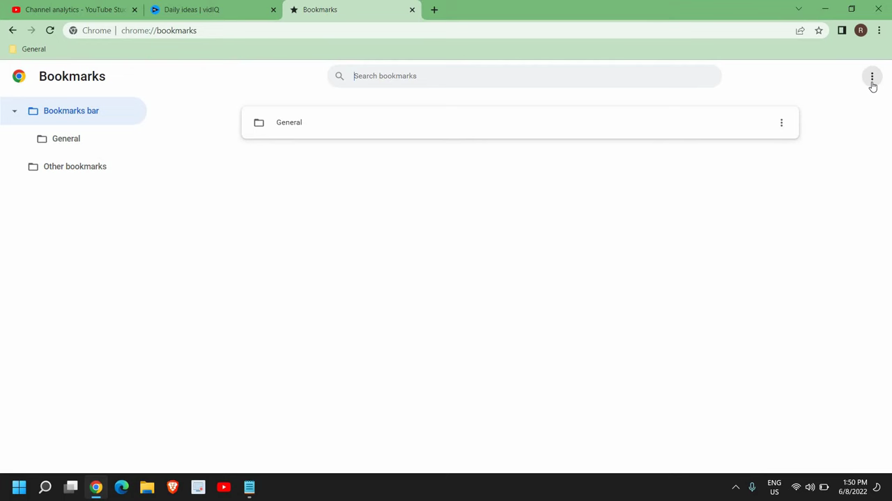
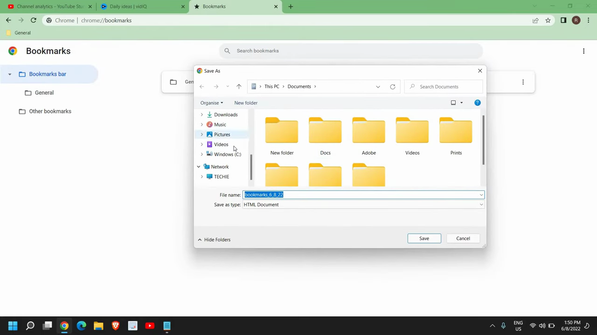
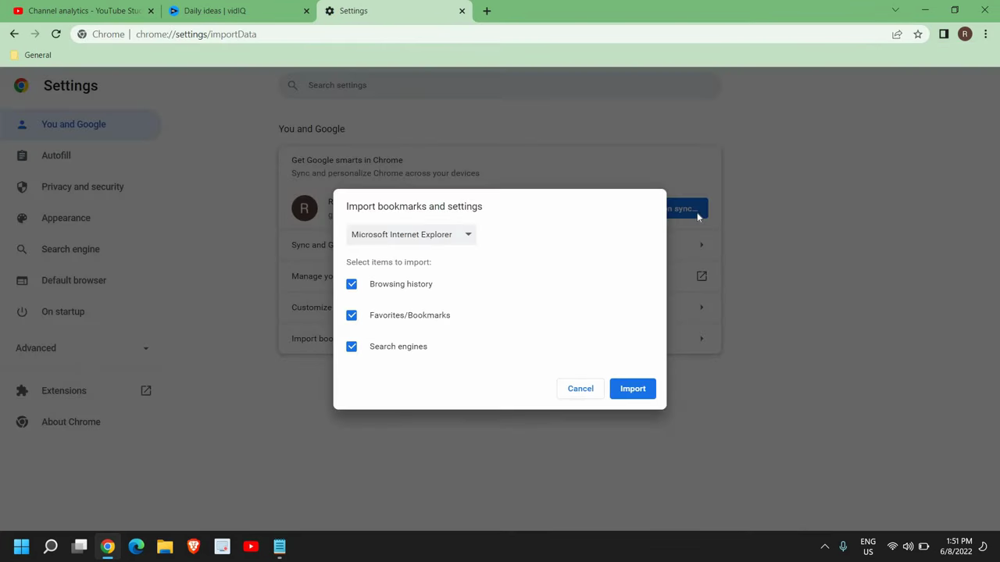
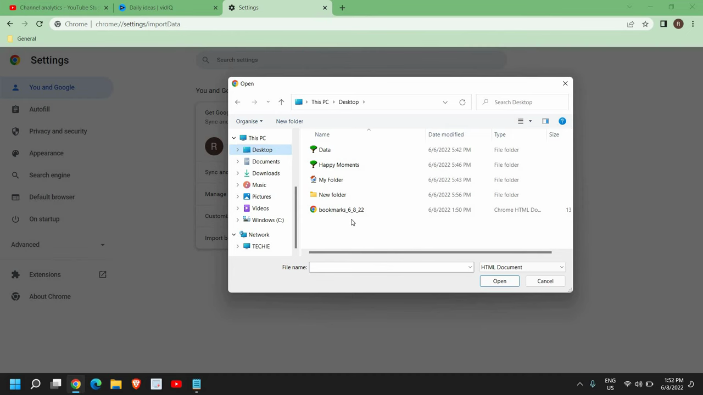

# Import and Export Bookmarks

1. Open Chrome and click the three-dot menu (⋮) in the top-right corner.

   

2. Hover over 'Bookmarks' in the dropdown menu, then click 'Bookmark manager' to open chrome://bookmarks.

   

3. In the Bookmark Manager, click the three-dot menu (⋮) near the top of the page.

   

4. Click 'Export bookmarks'. In the file dialog that appears, choose a destination (e.g., Desktop) and click Save. An HTML file will be saved to that location.

   

5. To import bookmarks on the same or a new computer, click the three-dot menu (⋮) again, hover over 'Bookmarks', and click 'Import bookmarks and settings'.

   

6. In the import dialog, select 'Bookmarks HTML file' from the dropdown menu.

   

7. Click 'Choose File', navigate to the exported HTML bookmarks file, select it, and click Open. Your bookmarks will be imported successfully.

   
