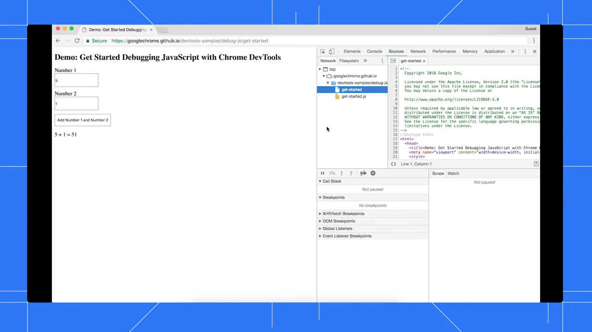
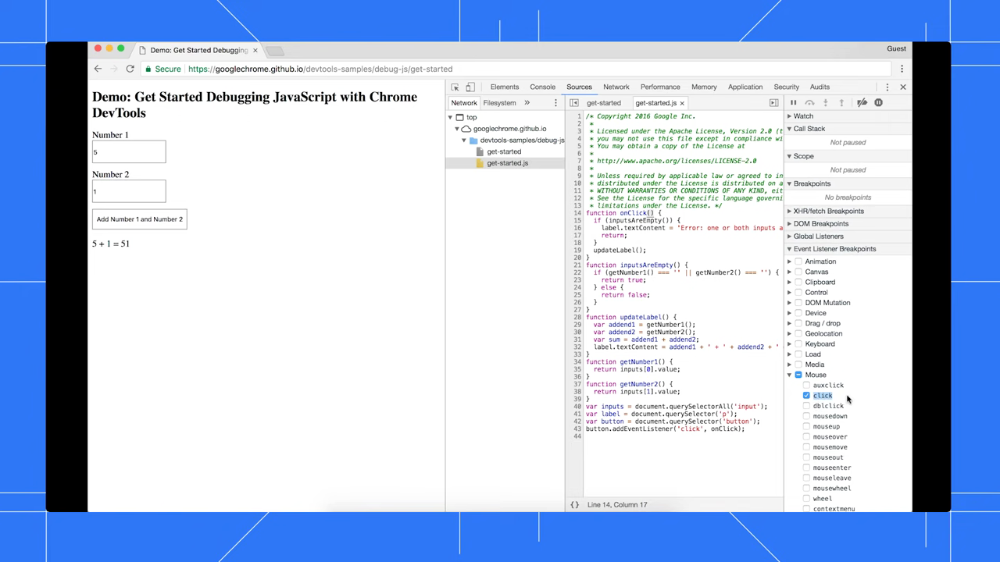
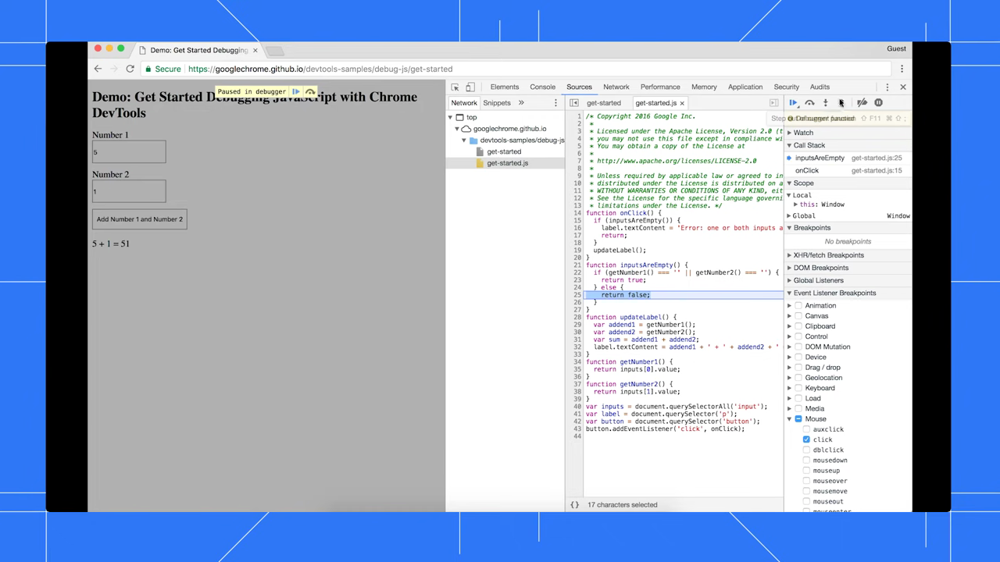

# Use the Console Panel

1. Open Chrome DevTools by pressing Command+Option+J (Mac) or Ctrl+Shift+J (Windows/Linux) to open directly to the Console panel.

   

2. In the Console panel, type a JavaScript expression (e.g., `2 + 2`) and press Enter to execute it and see the result.

   

3. Use `console.log()`, `console.warn()`, and `console.error()` in your JavaScript code to output messages at different severity levels, which appear color-coded in the Console.

   

4. Click the filter icons (All, Errors, Warnings, Info, Verbose) at the top of the Console to show only the message types you care about.

   

5. Click on any error or warning message in the Console to expand its stack trace and navigate to the source file and line number where it originated.

   

6. Use the Console drawer alongside other panels by pressing Escape while in the Sources or Elements panel to toggle the Console at the bottom.

   

7. Clear the Console output by clicking the clear button (circle with a line) or pressing Ctrl+L (Cmd+K on Mac) to remove all logged messages.
