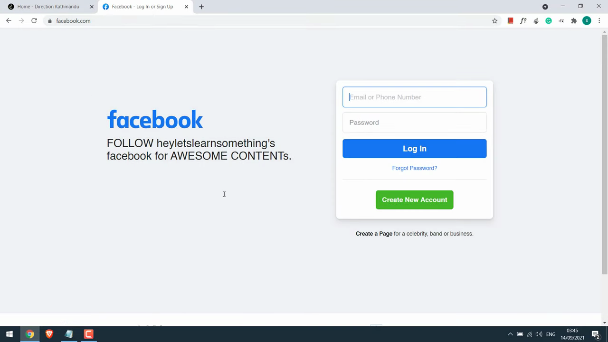
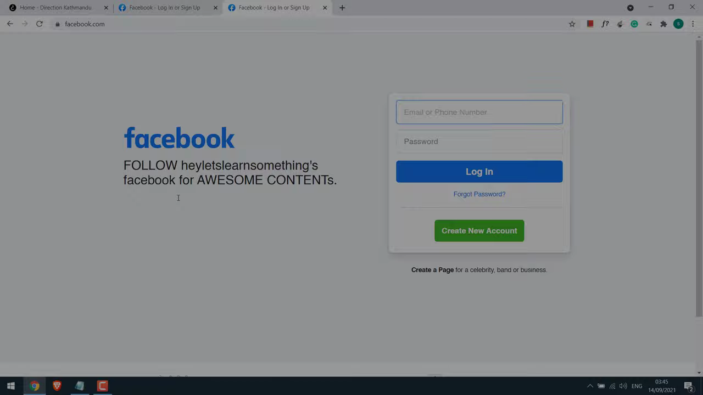
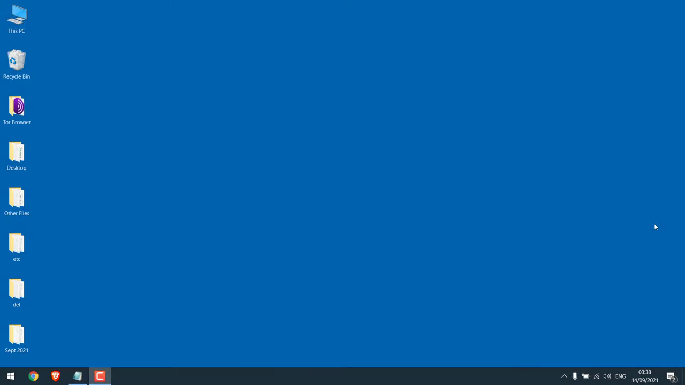
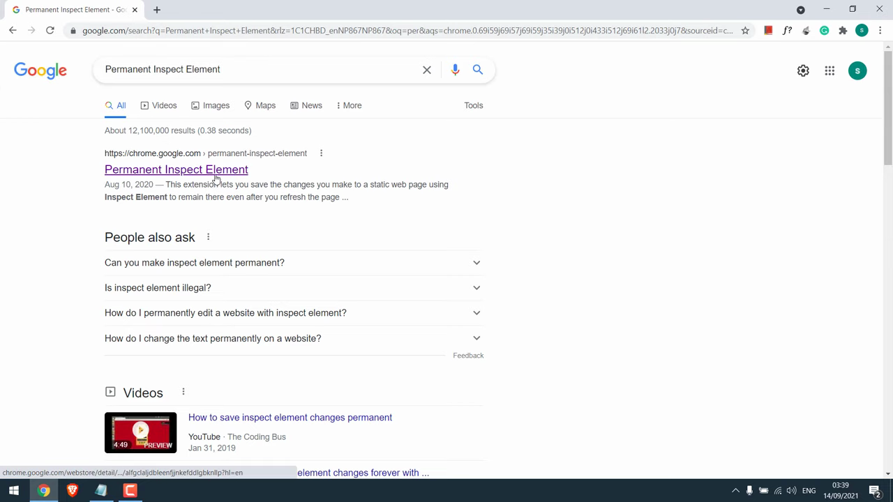
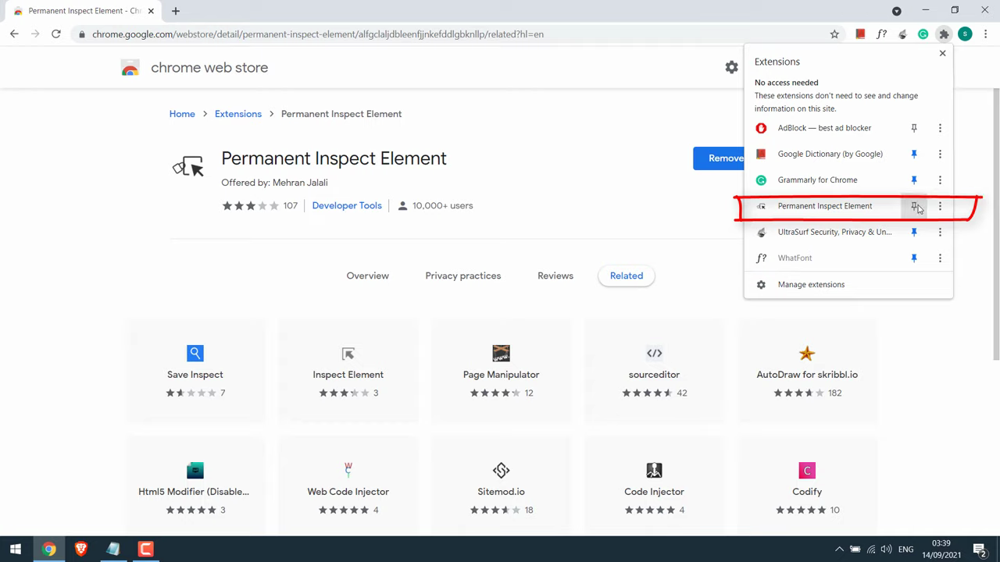

# Inspect and Edit Page Elements

1. Open Chrome and navigate to any webpage you want to inspect. Right-click on any element on the page.

   

2. Click 'Inspect' (or 'Inspect Element') from the context menu to open Chrome DevTools.

   

3. In DevTools, click the 'Elements' panel tab to view the page's HTML structure.

   

4. Click on any HTML element in the Elements panel to select it. The corresponding element will be highlighted on the page.

   

5. Double-click the element's text or attribute in the Elements panel to edit it inline. Press Enter to confirm your change — the page updates live.

   

6. In the Styles pane on the right side of DevTools, click any CSS property value to edit it, or click the '+' icon to add a new CSS rule.

   

7. Use the element picker tool (the cursor icon in the top-left of DevTools, or press Ctrl+Shift+C / Cmd+Shift+C) to click directly on a page element to jump to it in the Elements panel.
8. Note: All edits made in DevTools are temporary and will be lost on page refresh. They only affect your local view and are not saved to the server.
