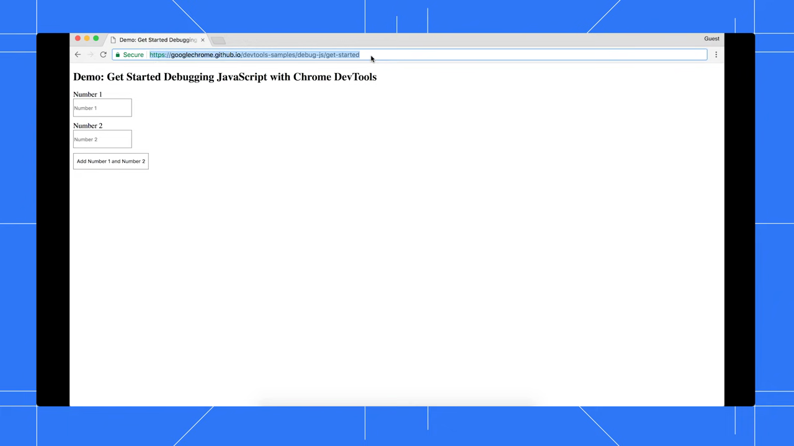
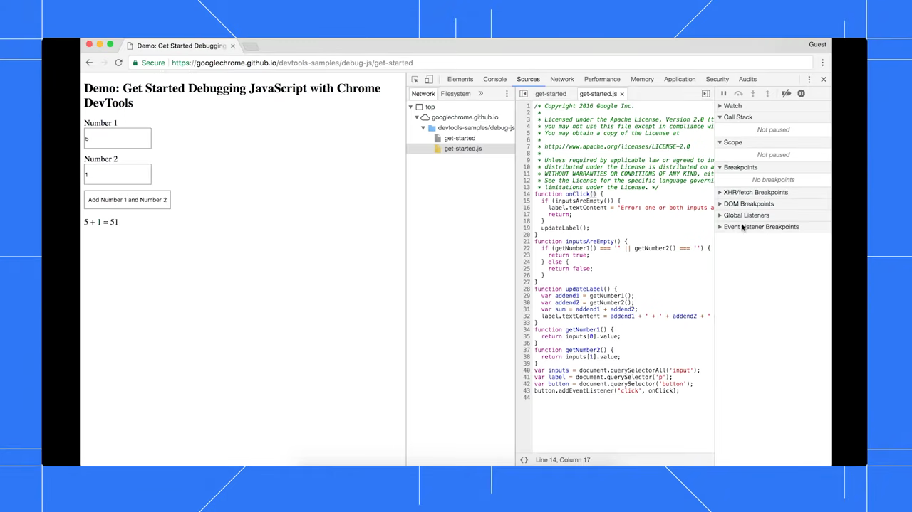
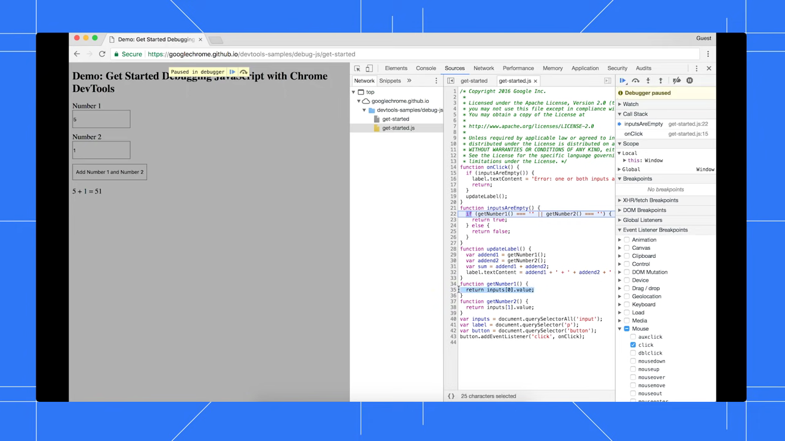

# Inspect Network Requests

1. Open Chrome DevTools by pressing Command+Option+J (Mac) or Ctrl+Shift+J (Windows/Linux), then click the 'Network' tab at the top of the DevTools panel.

   

2. Reload the page (Ctrl+R or Command+R) to capture all network requests from the start. The Network panel will populate with a list of HTTP requests made by the page.

   

3. Click on any request in the list to open its detail pane. Use the 'Headers' tab to inspect the request URL, method, status code, and both request and response headers.

   

4. Click the 'Preview' or 'Response' tab in the request detail pane to view the response body returned by the server.

   

5. Use the filter bar at the top of the Network panel to filter requests by type (e.g., XHR, JS, CSS, Img) or by keyword to narrow down the requests you want to inspect.

   

6. Check the 'Timing' tab in the request detail pane to analyze how long each phase of the request took (DNS lookup, connection, waiting, download), which helps identify performance bottlenecks.

   

7. Enable the 'Preserve log' checkbox in the Network panel toolbar to keep request history across page navigations, useful when debugging redirects or multi-page flows.
