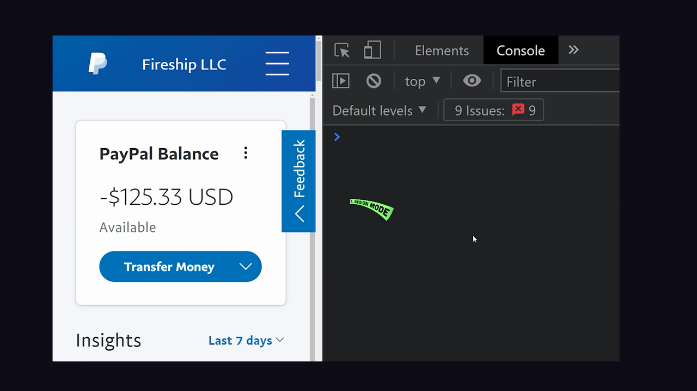
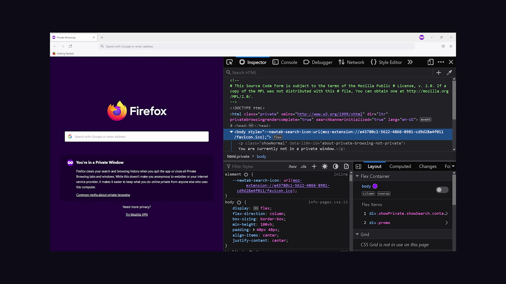
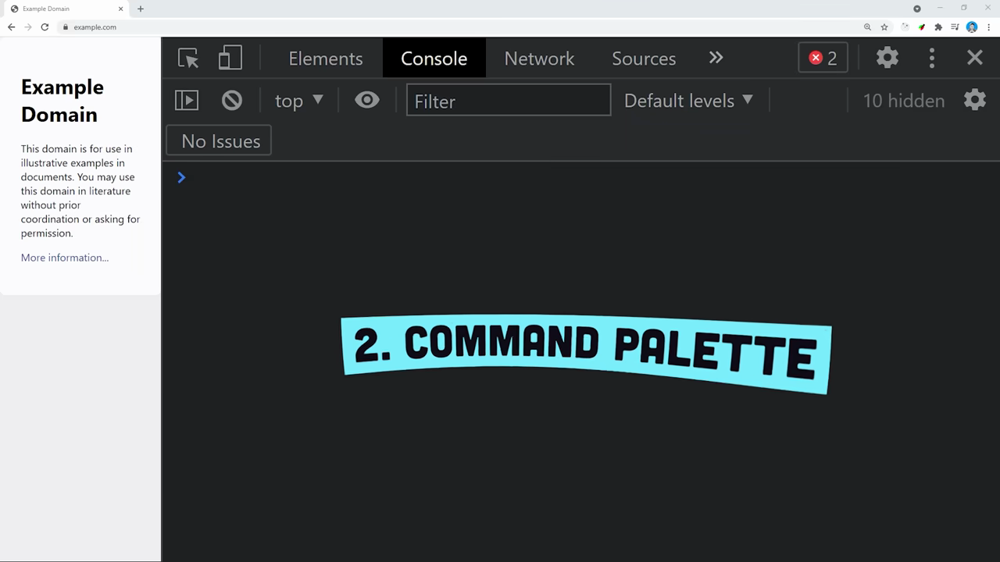
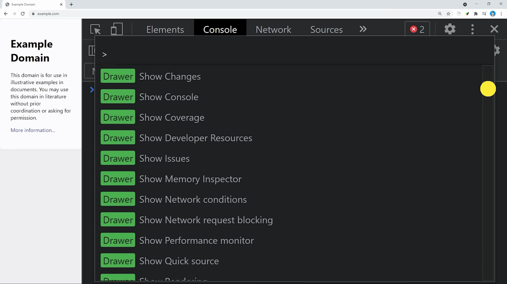

# Open DevTools

1. Open Chrome and navigate to any webpage you want to inspect
2. Press Ctrl+Shift+J (Windows/Linux) or Cmd+Option+J (Mac) to open DevTools directly to the Console panel

   

3. Alternatively, press F12 or Ctrl+Shift+I (Cmd+Option+I on Mac) to open DevTools to the Elements panel
4. Or right-click anywhere on the page and select 'Inspect' from the context menu to open DevTools with the clicked element highlighted

   

5. To open via the menu, click the three-dot menu (⋮) in the top-right corner of Chrome, select 'More tools', then 'Developer tools'

   

6. Once DevTools is open, use Ctrl+P (Cmd+P on Mac) to open the command palette — type '>' to see all available DevTools commands

   
