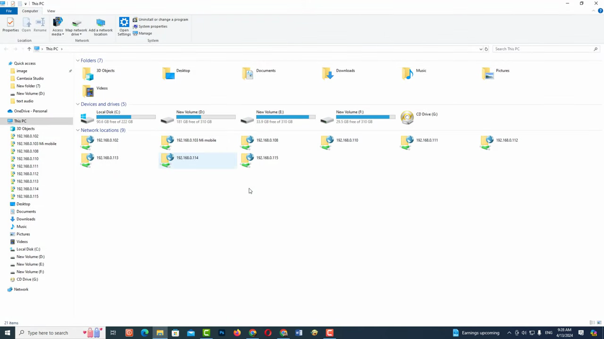
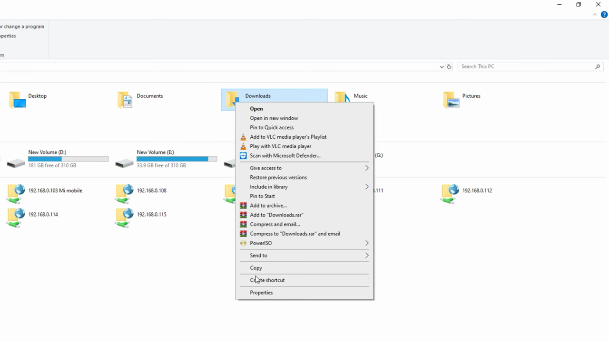
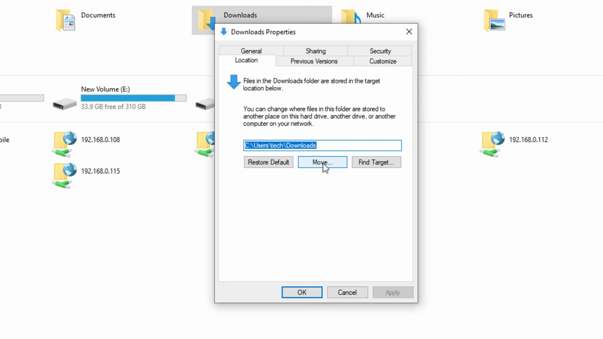
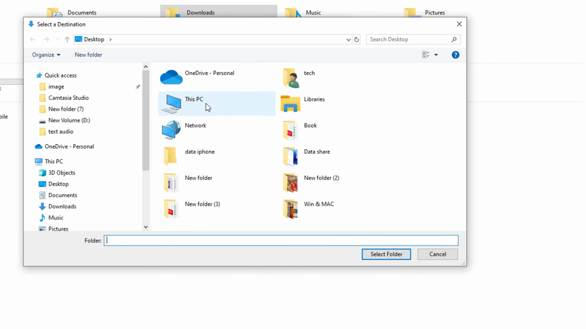
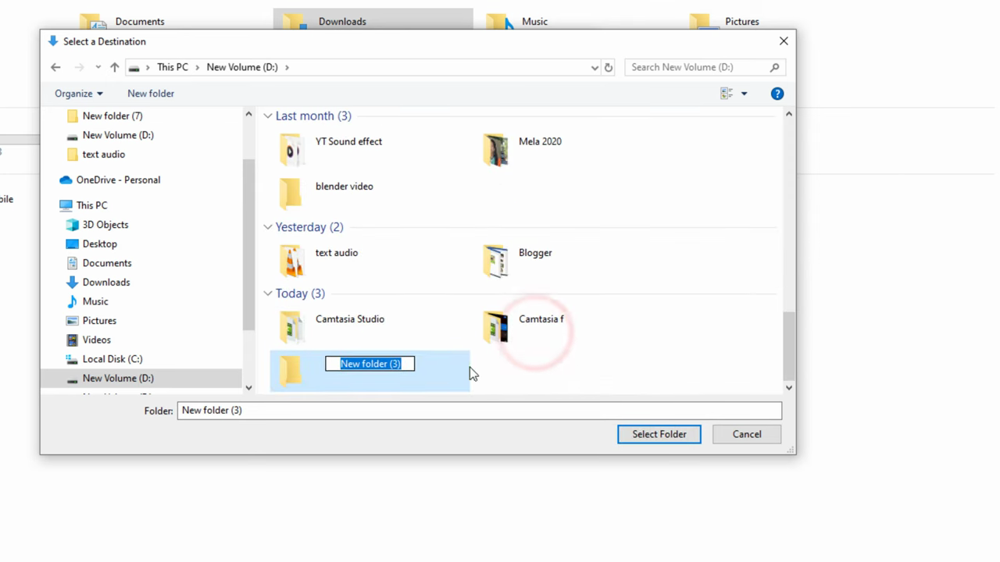
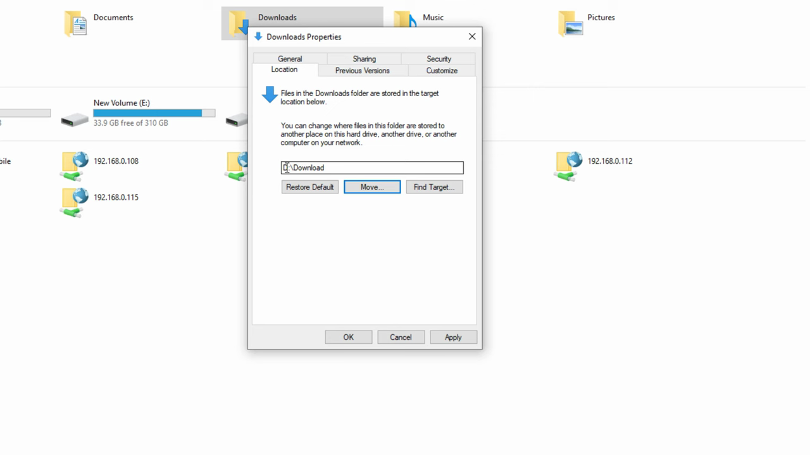

# Change Download Location

1. Open Chrome and click the three-dot menu (⋮) in the top-right corner.

   

2. Select 'Settings' from the dropdown menu.

   

3. In the Settings page, scroll down and click 'Downloads' in the left sidebar, or navigate directly to chrome://settings/downloads.

   

4. Under 'Location', click the 'Change' button to set a new default download folder.

   

5. In the file browser dialog, navigate to your desired folder (or create a new folder named 'Downloads') and click 'Select Folder'.

   

6. Optionally, toggle on 'Ask where to save each file before downloading' if you want Chrome to prompt you for a save location on every download.

   

7. Your new download location is now saved. Future downloads will go to the selected folder automatically.
