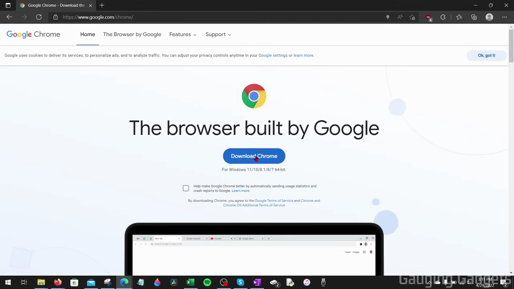
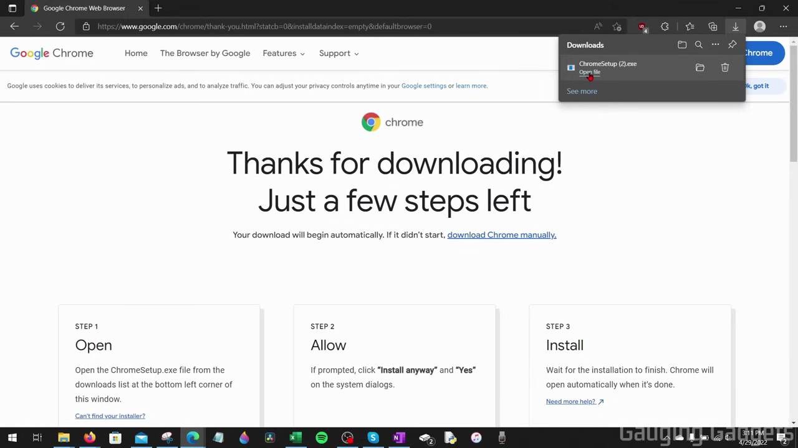
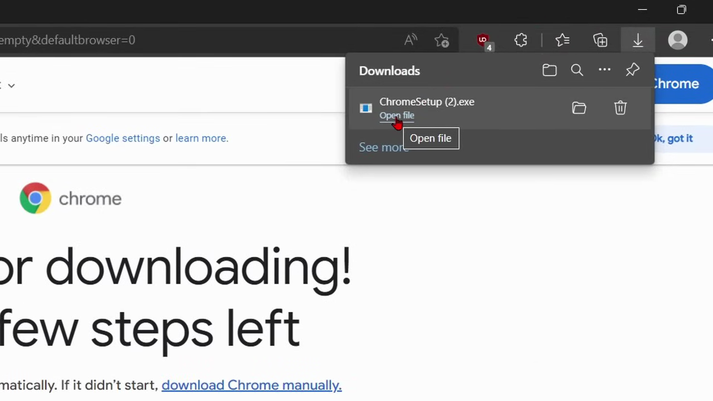
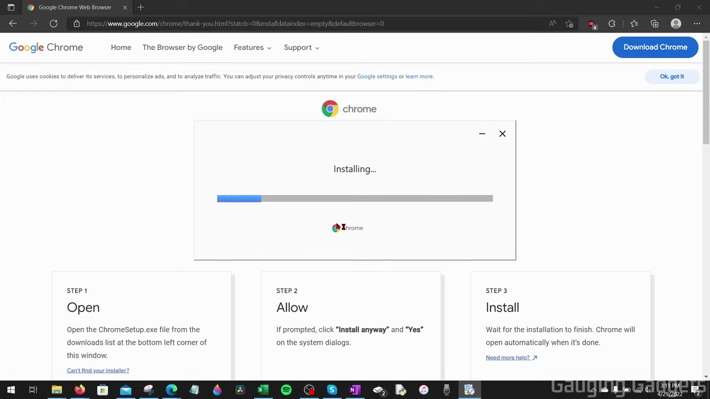

# Download a File

1. Open Chrome and navigate to the webpage containing the file you want to download.
2. Click the download link or button on the page (e.g., 'Download Chrome').

   

3. A download notification appears in the top-right corner of Chrome. Click it to see download options.

   

4. Click 'Open file' in the download popup to open the file immediately after it finishes downloading.

   

5. To view all downloads, navigate to chrome://downloads in the address bar.
6. Monitor download progress in the Downloads page — active downloads show a progress bar and remaining time.

   
