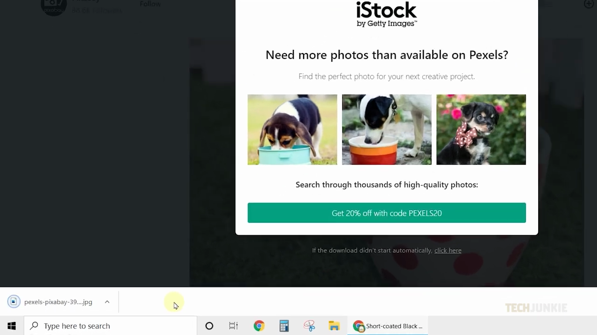
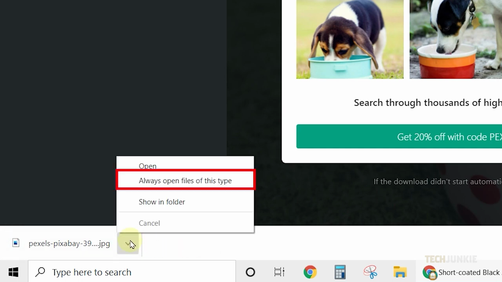
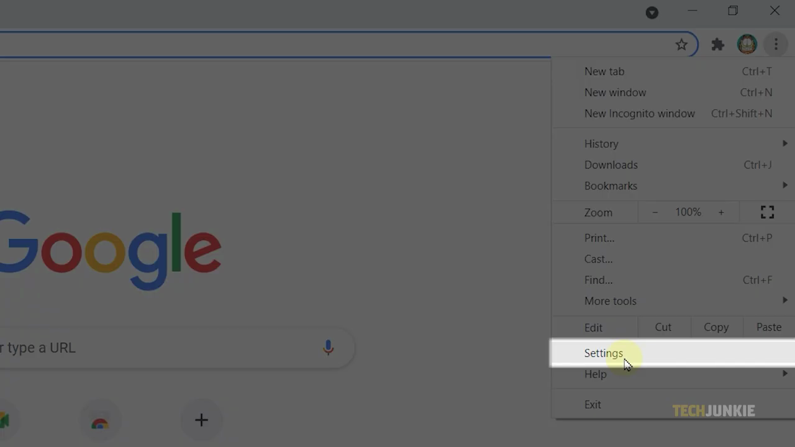
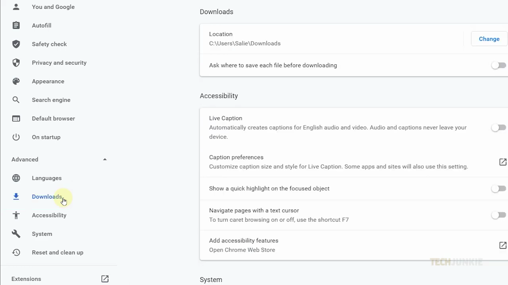
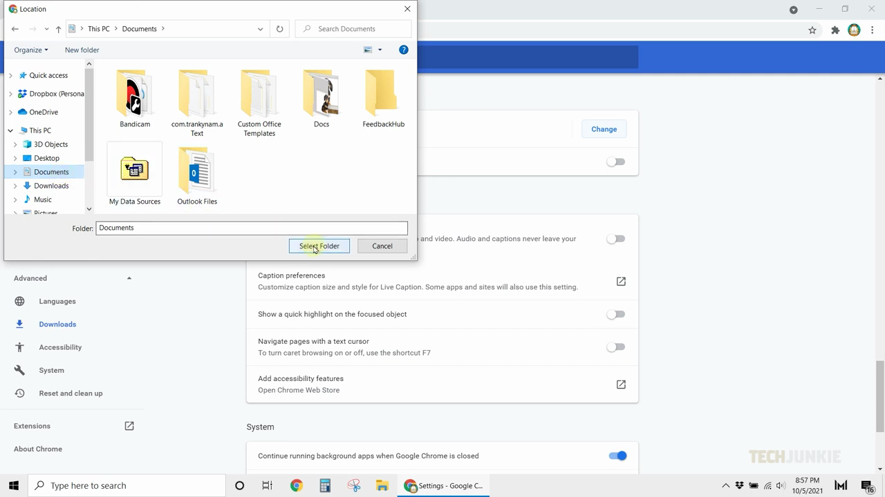
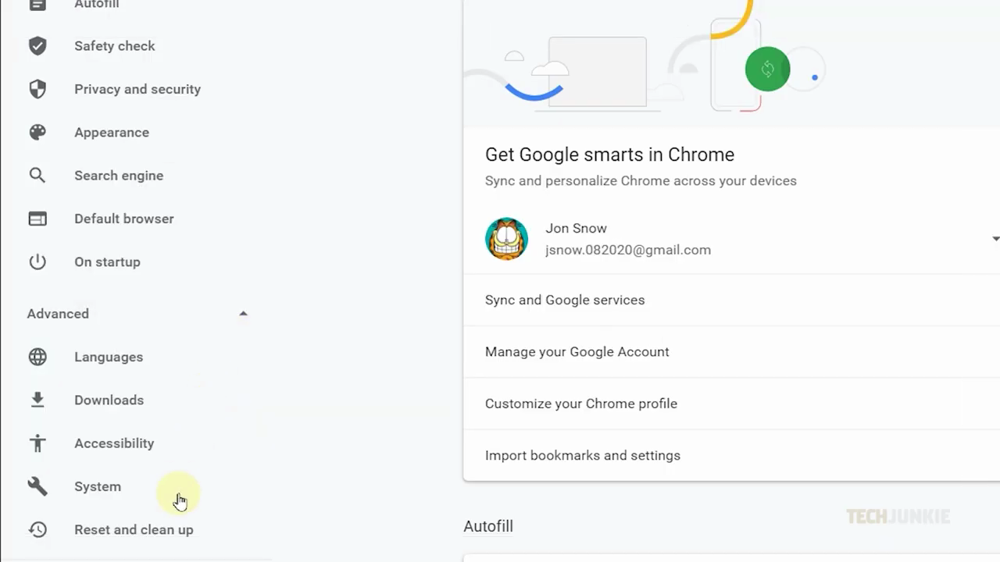

# View Download History

1. Open Chrome and download any file. A download tray will appear at the bottom of the screen when the download completes.

   

2. Click the small upward arrow next to the downloaded file in the tray, then select 'Always open files of this type' to auto-open future downloads of the same format.

   

3. To find or change your download location, click the three-dot menu in the top-right corner of Chrome and select 'Settings'.

   

4. In Settings, click 'Advanced' in the left sidebar, then select 'Downloads' to view and manage download preferences.

   

5. Click the 'Change' button next to the download location path to set a preferred folder, then click 'Select Folder' to confirm.

   

6. Optionally, enable 'Ask where to save each file before downloading' to choose a different folder each time you download.
7. To reset Chrome to defaults, go to Settings > Advanced > 'Reset and clean up', select 'Restore settings to their original defaults', then click 'Reset settings'.

   
