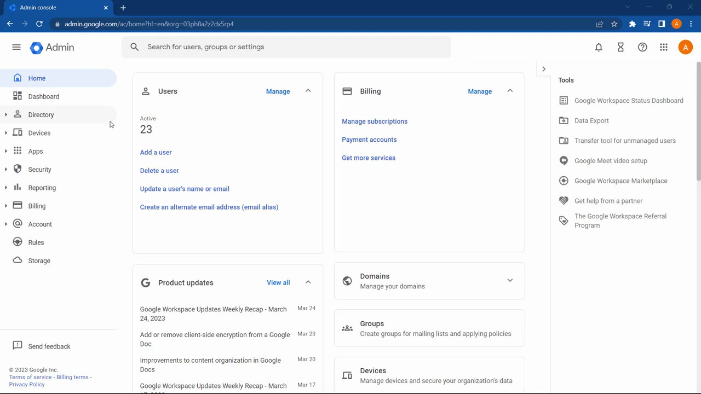
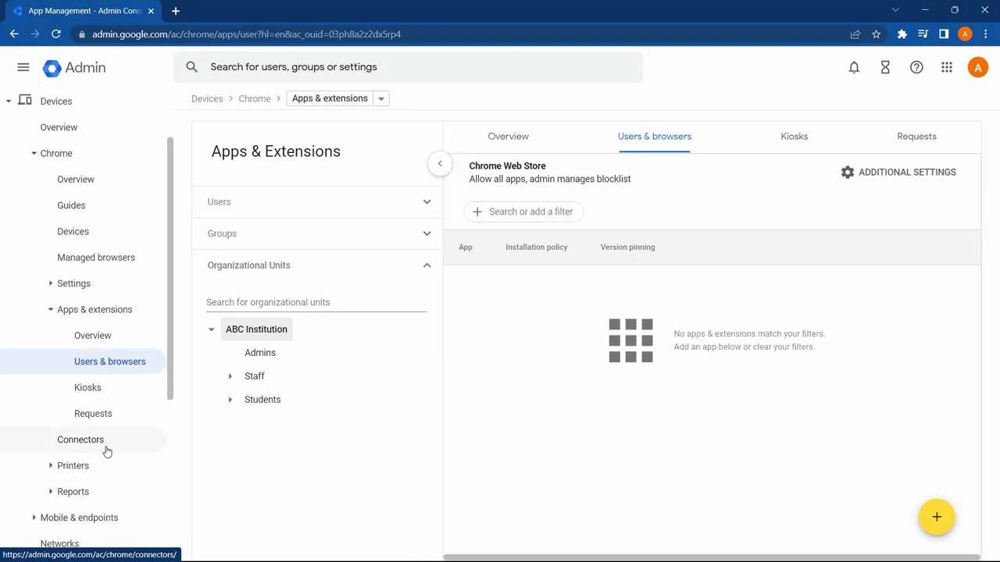
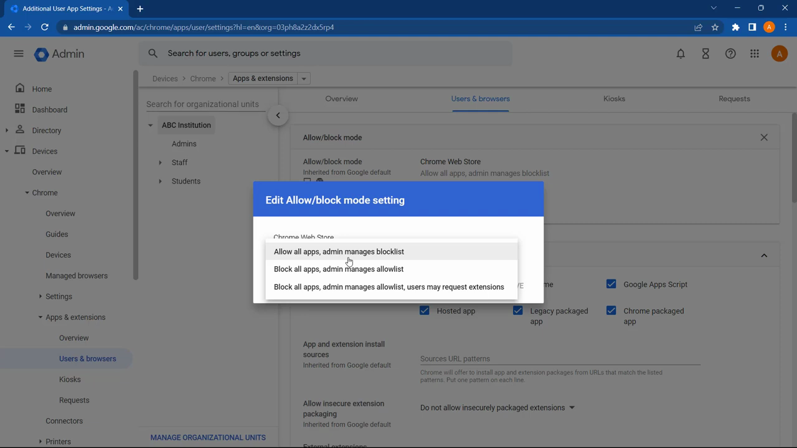
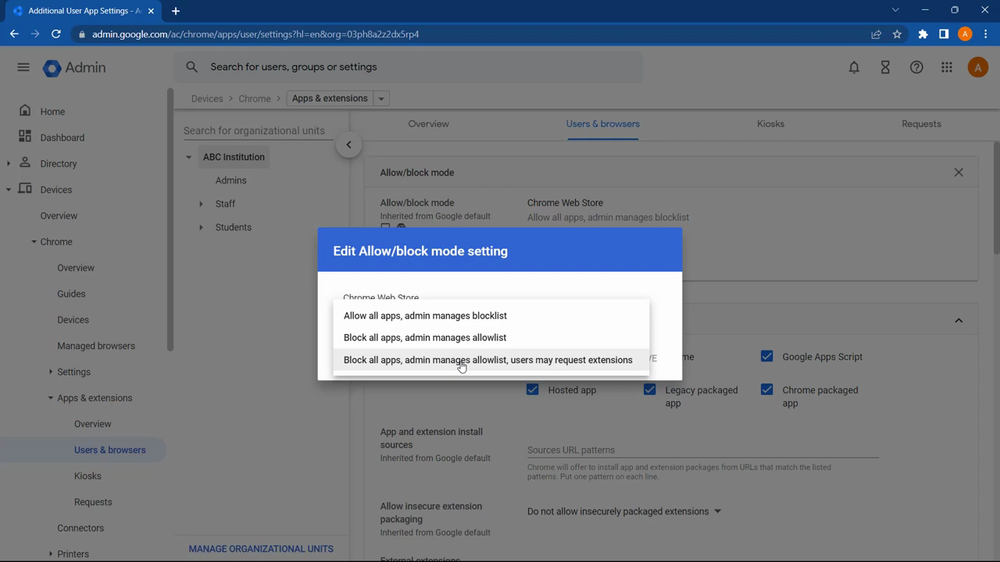
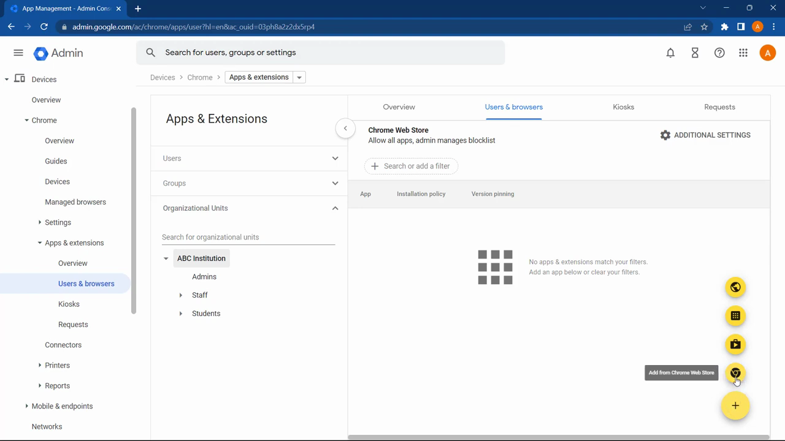

# Manage Extension Permissions

1. Click the Extensions puzzle-piece icon in the Chrome toolbar, then click 'Manage extensions' to open chrome://extensions

   

2. Find the extension you want to manage and click 'Details' to open its detail page

   

3. Scroll down to the 'Site access' section to see the current permission level granted to the extension

   

4. Click the 'Site access' drop-down and choose one of the options: 'On click', 'On specific sites', or 'On all sites'

   

5. If you selected 'On specific sites', click 'Add a site', enter the URL, and click 'Add'

   

6. To revoke all site access for the extension, return to chrome://extensions, click 'Details', and toggle off any listed permissions under 'Permissions'
