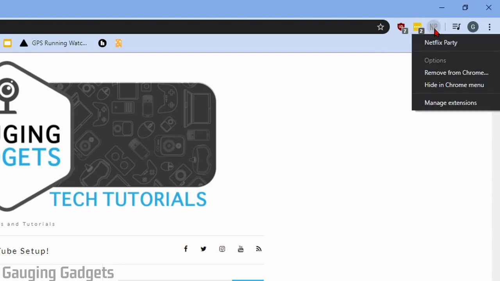
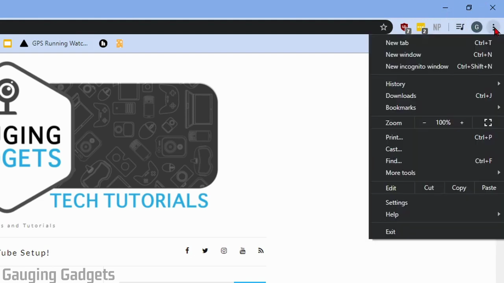
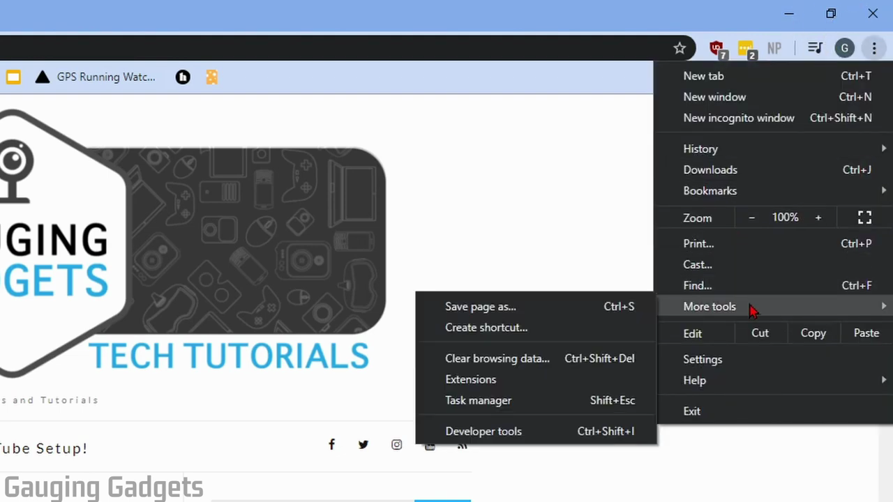
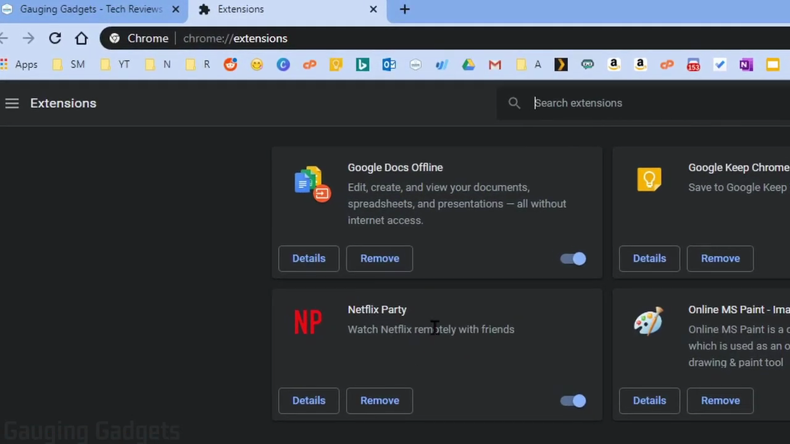
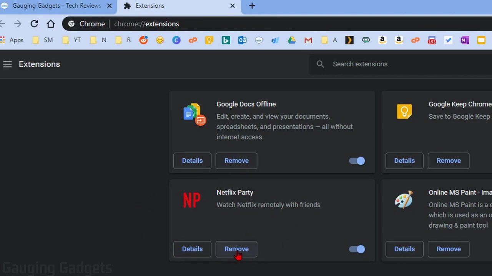
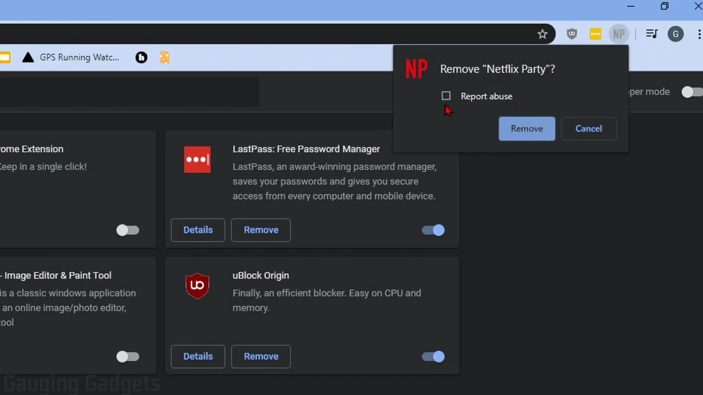

# Enable, Disable, and Remove Extensions

1. Open Chrome. If the extension icon is visible in the toolbar (top-right), right-click it and select 'Remove from Chrome' to uninstall it immediately.

   

2. If the extension is not visible in the toolbar, click the three-dot menu (⋮) in the top-right corner of Chrome.

   

3. Hover over 'More tools' in the dropdown menu, then click 'Extensions' in the submenu. Alternatively, navigate directly to chrome://extensions.

   

4. On the Extensions page, find the extension you want to manage. Use the toggle switch to enable or disable an extension without removing it.

   

5. To remove an extension entirely, click the 'Remove' button on its card.

   

6. In the confirmation dialog, click 'Remove' to confirm. If the extension seems malicious, check 'Report abuse' before confirming.

   

7. The extension is now removed. Return to chrome://extensions to verify it no longer appears in your list.
