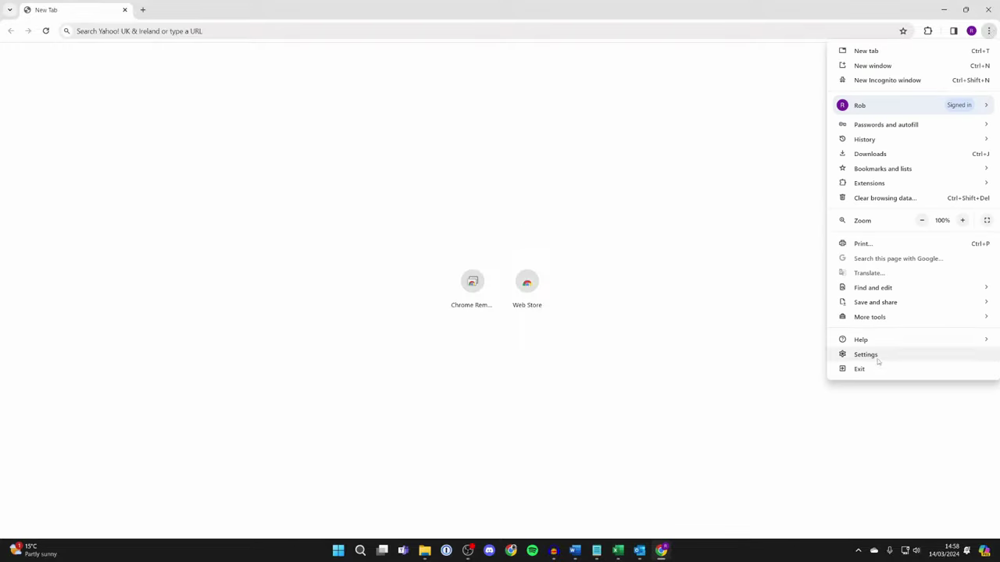
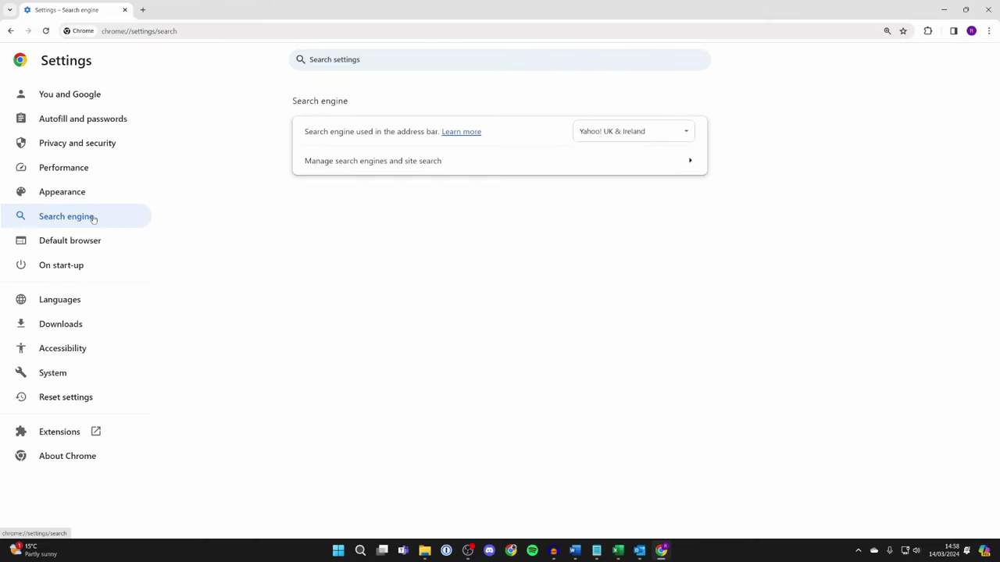
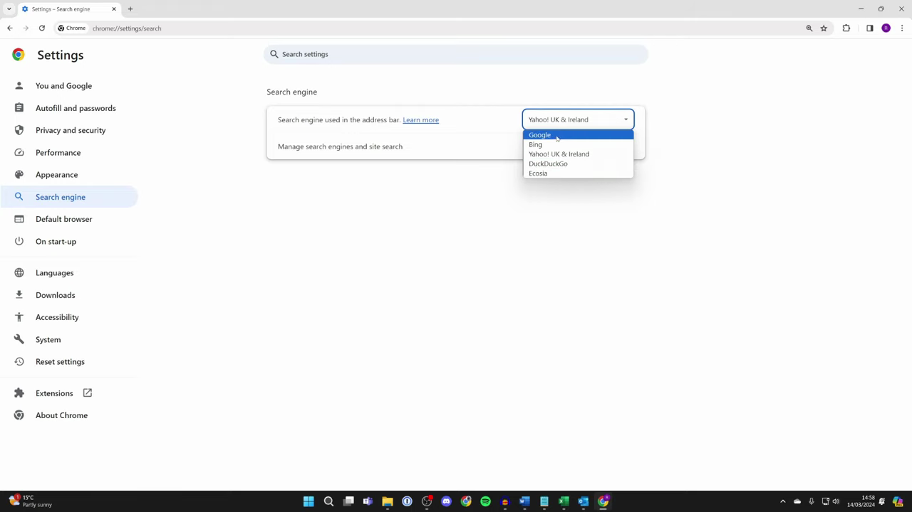
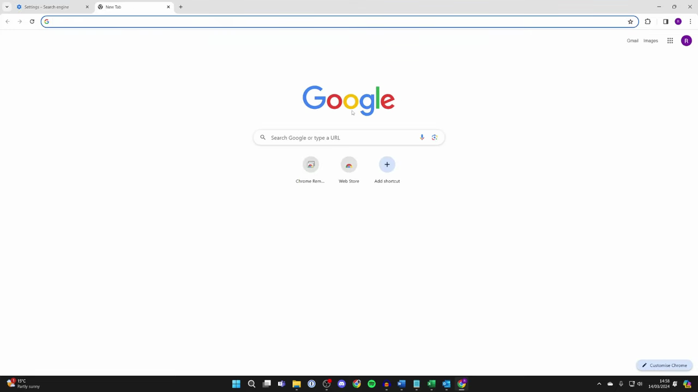

# Search from Address Bar

1. Open Chrome and click the three-dot menu (⋮) in the top-right corner, then select 'Settings'.

   

2. In the Settings sidebar on the left, click 'Search engine' (or navigate to chrome://settings/search).

   

3. Locate the 'Search engine used in the address bar' dropdown under the Search engine section.

   

4. Click the dropdown and select a search engine (e.g., Google) to restore Omnibox search functionality.

   

5. Open a new tab — the address bar (Omnibox) is now active and ready to accept searches or URLs.

   

6. Click the address bar, type a search query or URL, and press Enter to search or navigate.
