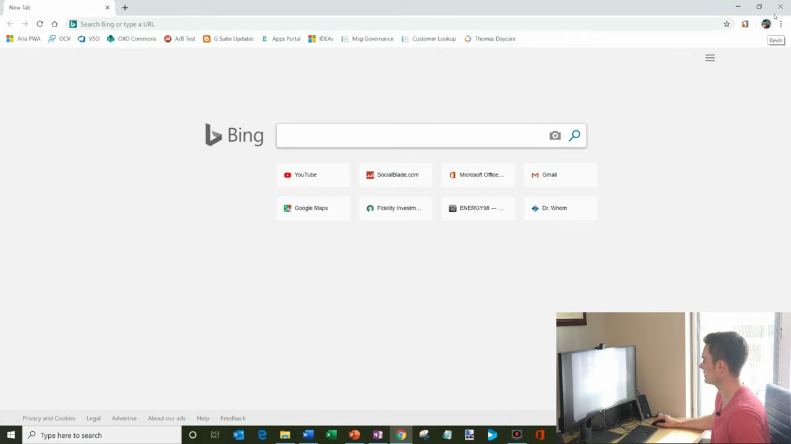
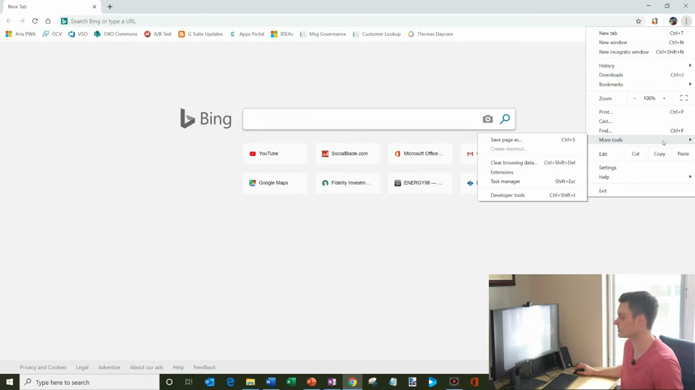
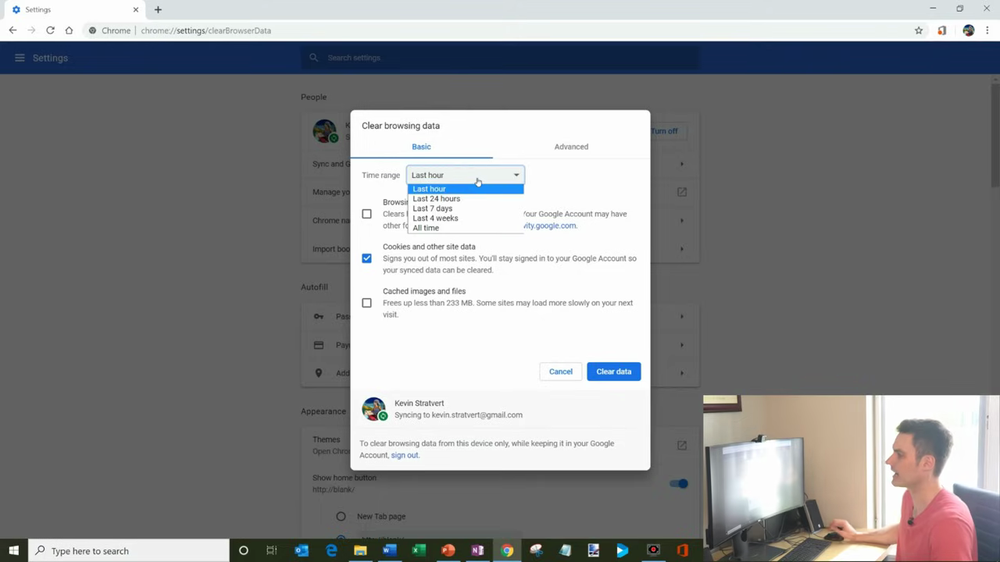
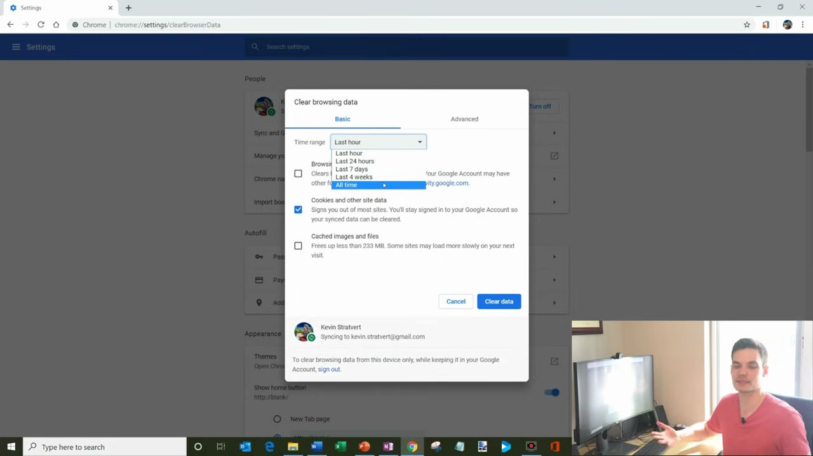
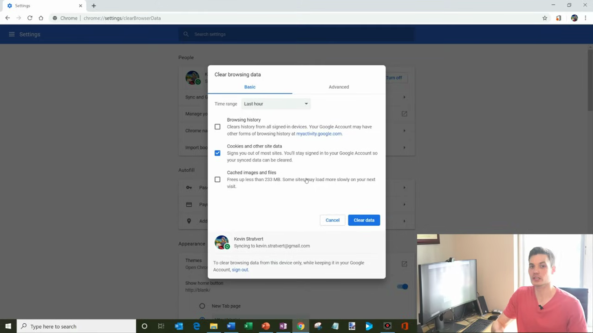

# View and Clear Browsing History

1. Open Chrome and click the three-dot menu (⋮) in the top-right corner

   

2. Hover over 'More tools' in the dropdown menu, then click 'Clear browsing data' — or use the shortcut Ctrl+Shift+Delete (Windows) / Cmd+Shift+Delete (Mac)

   

3. In the 'Clear browsing data' dialog, select a time range from the dropdown (e.g. 'Last hour', 'Last 7 days', or 'All time')

   

4. Check the boxes for the data types you want to delete: 'Browsing history', 'Cookies and other site data', and/or 'Cached images and files'

   

5. Note: Clearing cookies will sign you out of most websites; clearing cache may slow initial page loads temporarily
6. Click 'Clear data' to delete the selected browsing data

   
