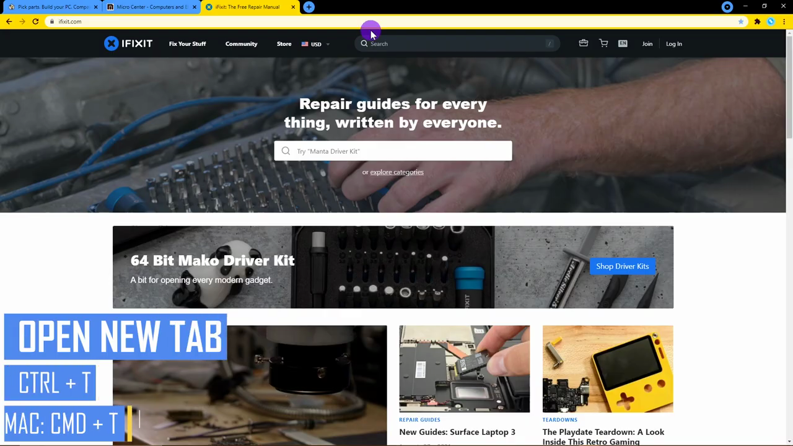

# Keyboard Shortcuts

1. Open a new tab using Ctrl+T (Windows/Linux) or Cmd+T (Mac) instead of clicking the + button.

   

2. Close the active tab using Ctrl+W (Windows/Linux) or Cmd+W (Mac) instead of clicking the X on the tab.
3. Cycle through open tabs left-to-right with Ctrl+Tab (Windows/Linux) or Cmd+Option+Right Arrow (Mac); reverse with Ctrl+Shift+Tab or Cmd+Option+Left Arrow.

   

4. Navigate to your Chrome home page with Alt+Home (Windows/Linux) or Cmd+Shift+H (Mac) without opening a new tab.
5. Reopen the most recently closed tab with Ctrl+Shift+T (Windows/Linux) or Cmd+Shift+T (Mac).

   

6. Close the entire browser window with Ctrl+Shift+W (Windows/Linux) or Cmd+Shift+W (Mac).
7. Jump to the address bar (Omnibox) to search or type a URL without reaching for the mouse.

   
