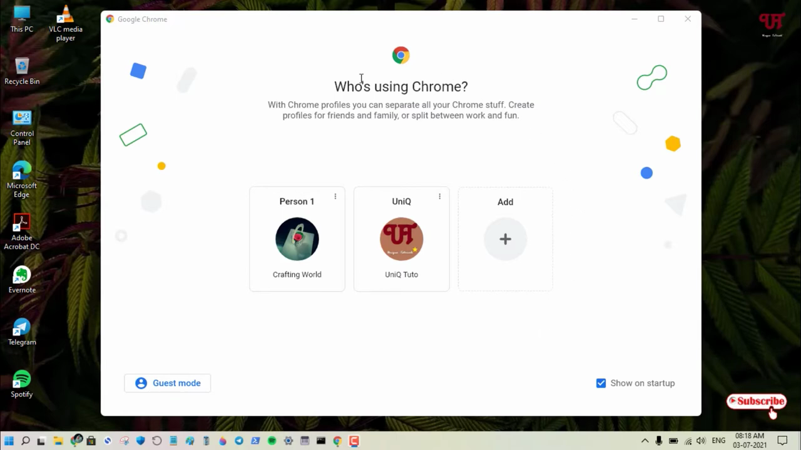
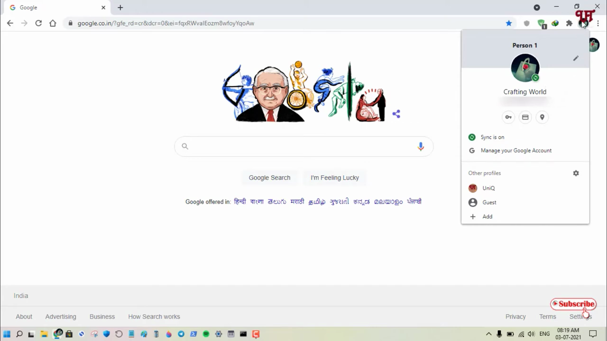
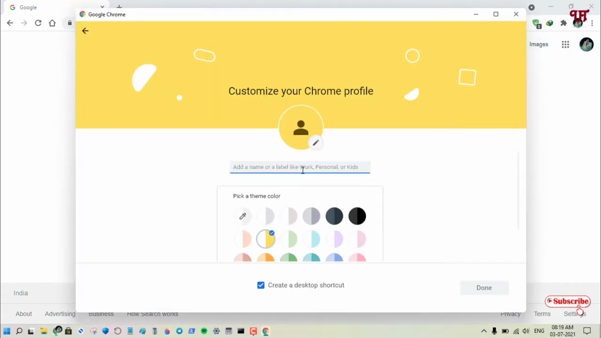
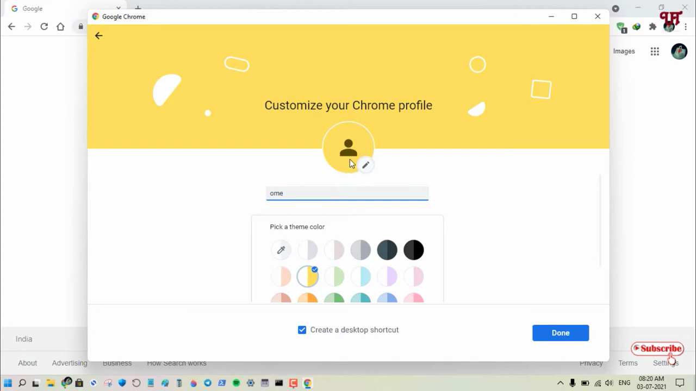
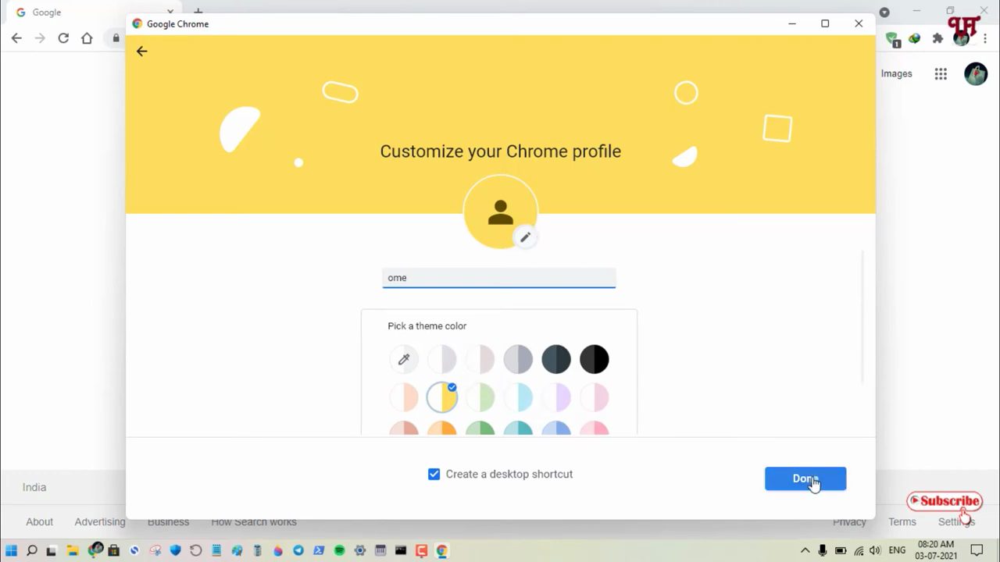

# Create a Chrome Profile

1. Open Chrome and click the profile icon (person icon) in the top-right corner of the browser window.

   

2. In the profile dropdown, scroll down and click 'Add' to create a new profile.

   

3. Enter a name for the new profile (e.g., 'Home') in the name field.

   

4. Optionally, choose a profile picture and theme color for the new profile.

   

5. Click 'Done' to finish creating the profile. A new Chrome window will open for the new profile.

   

6. To switch between profiles, click the profile icon in the top-right corner and select the desired profile from the list.

   
