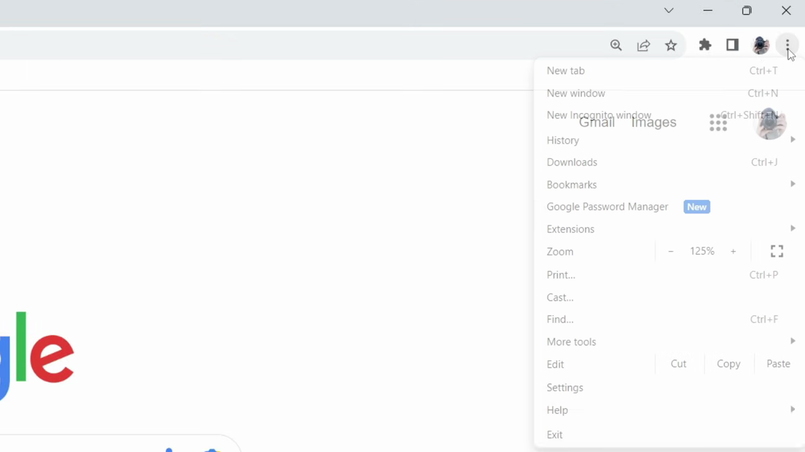
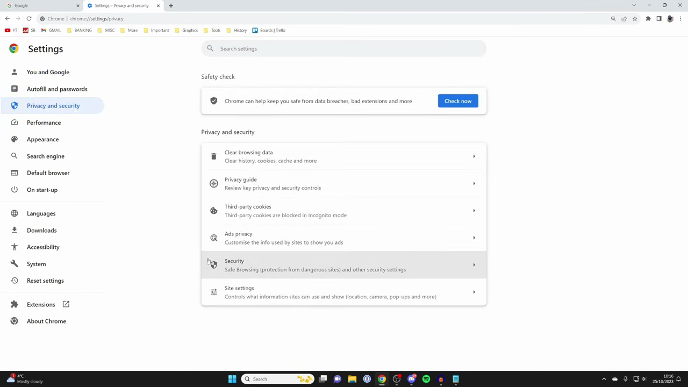
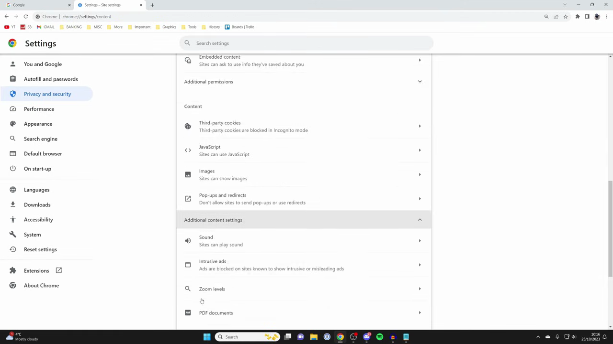
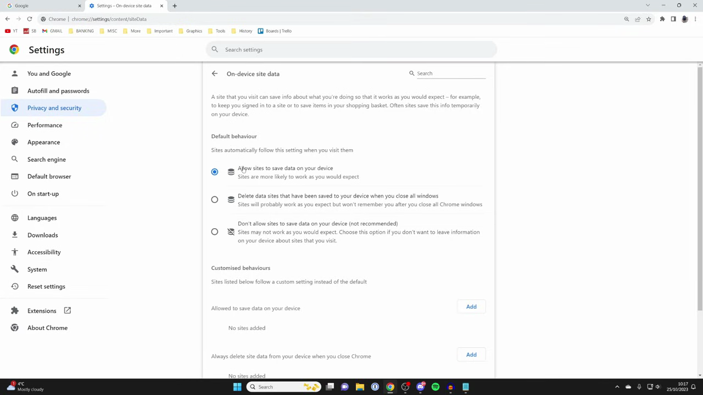
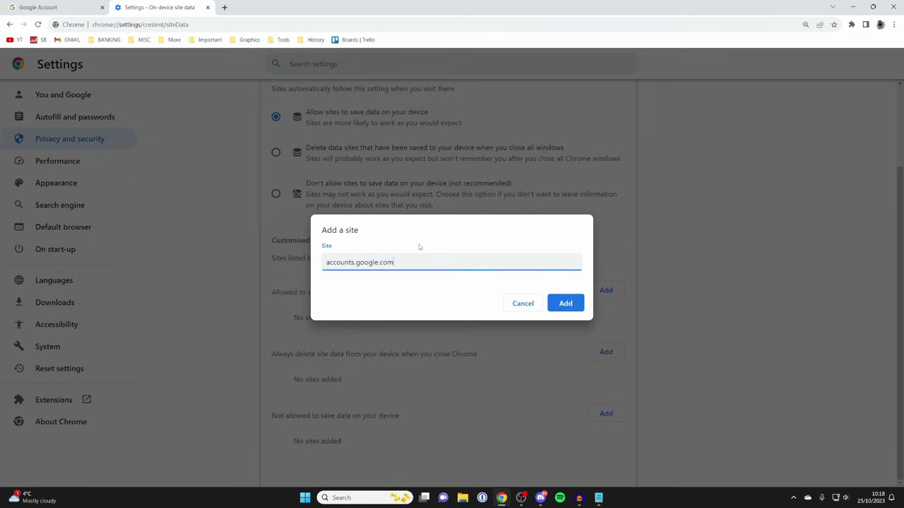
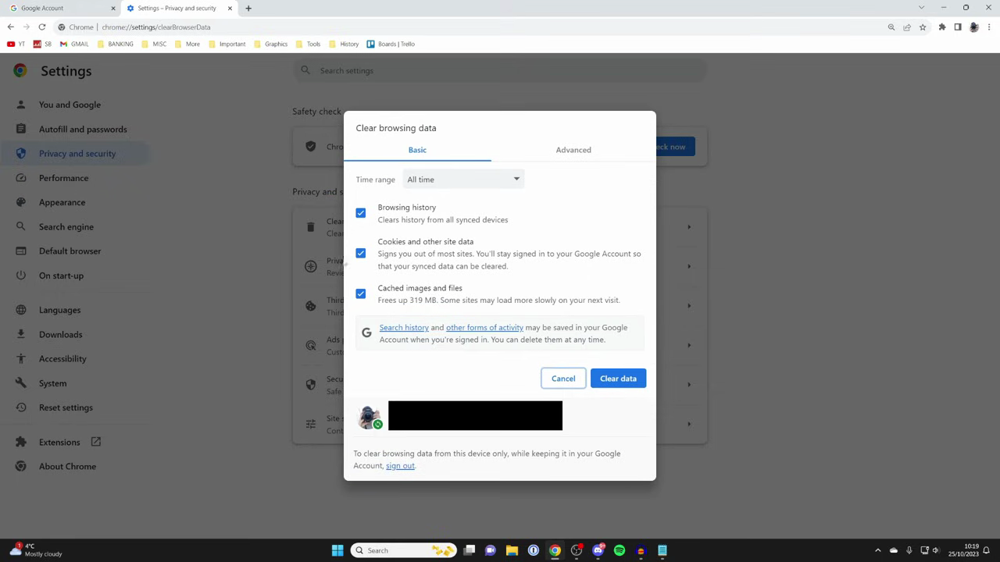

# Sign In and Enable Sync

1. Open Chrome and click the three-dot menu (⋮) in the top-right corner, then select 'Settings'.

   

2. In the left sidebar, click 'Privacy and security', then scroll down and click 'Site settings' (chrome://settings/content).

   

3. Scroll to the bottom of Site settings and click 'Additional content settings', then scroll down to 'On-device site data'.

   

4. Select 'Allow sites to save data on your device' to ensure session data is retained between browser restarts.

   

5. In the 'Allow to save data on your device' section, click 'Add', type 'accounts.google.com', and click 'Add' to whitelist Google's sign-in domain.

   

6. Close and reopen Chrome to verify you remain signed in and sync is active. If sync is still paused, proceed to the next step.
7. If the issue persists, go back to 'Privacy and security' and click 'Clear browsing data' (chrome://settings/clearBrowserData). Select all data types, set the time range to 'All time', and click 'Clear data'.

   

8. Close and reopen Chrome again. Sign back into your Google account and confirm that sync is now working without the 'Sync paused' error.
