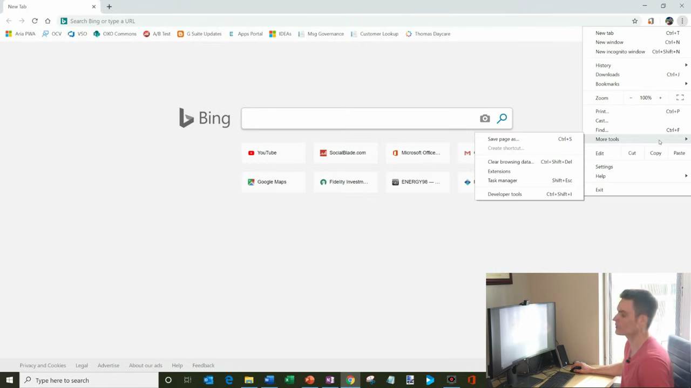
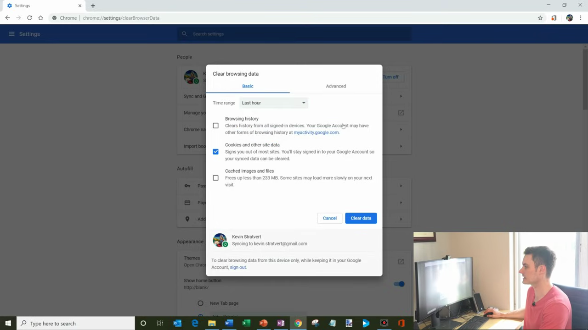
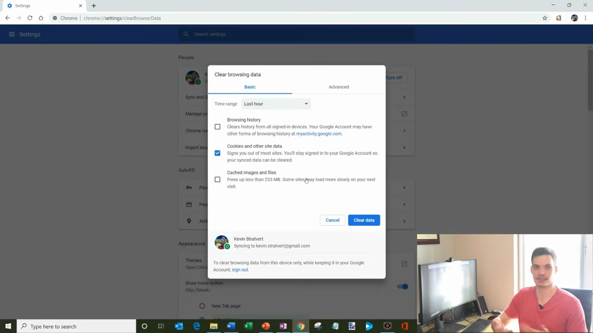

# Clear Cache and Cookies

1. Open Google Chrome on your computer.
2. Click the three-dot menu (⋮) in the top-right corner of the browser window.

   

3. Hover over 'More tools' in the dropdown menu, then click 'Clear browsing data'. Alternatively, press Ctrl+Shift+Delete (Windows) or Cmd+Shift+Delete (Mac) to open the dialog directly.

   

4. In the 'Clear browsing data' dialog (chrome://settings/clearBrowserData), select the desired time range from the dropdown — options include Last hour, Last day, Last week, Last 4 weeks, or All time.

   

5. Check the boxes for the data types you want to clear: 'Browsing history', 'Cookies and other site data', and/or 'Cached images and files'. Note: clearing cookies will sign you out of most websites.

   

6. Click the 'Clear data' button to confirm and delete the selected browsing data.

   
