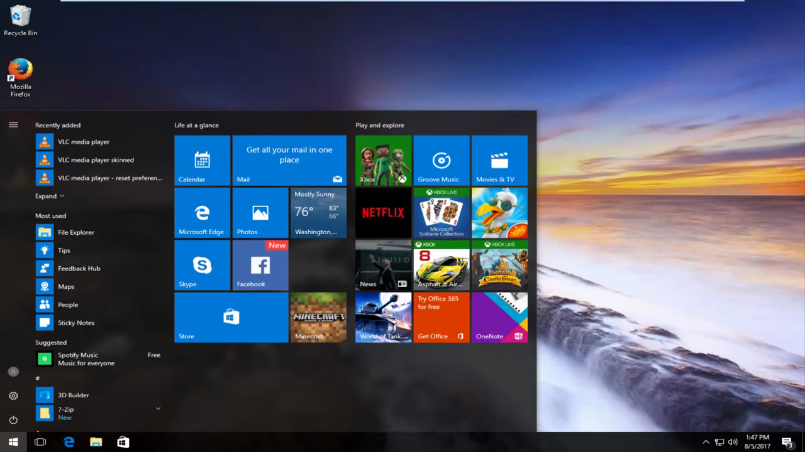
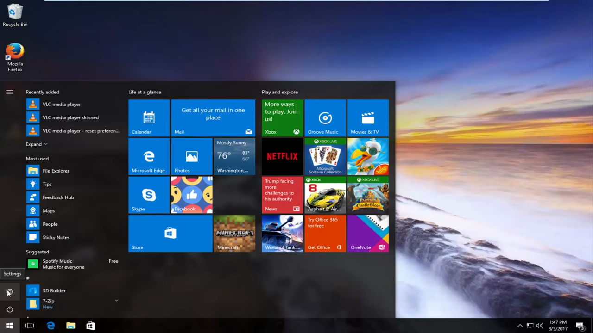
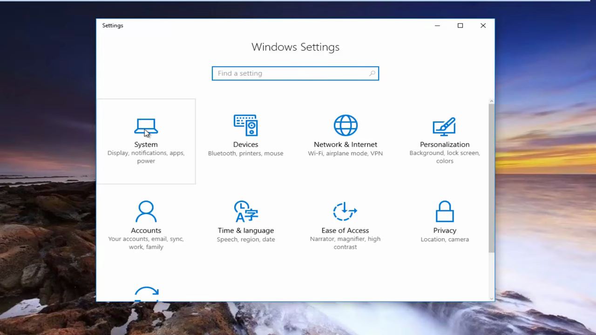
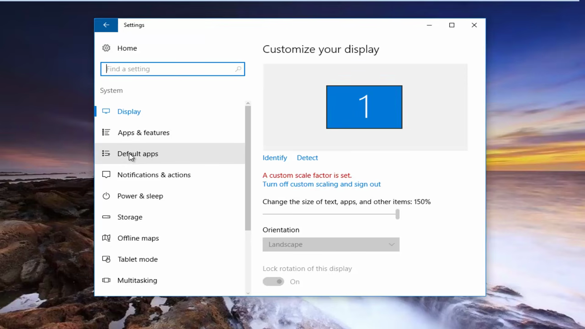
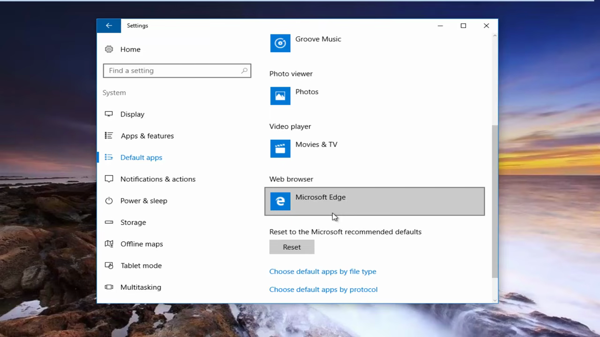
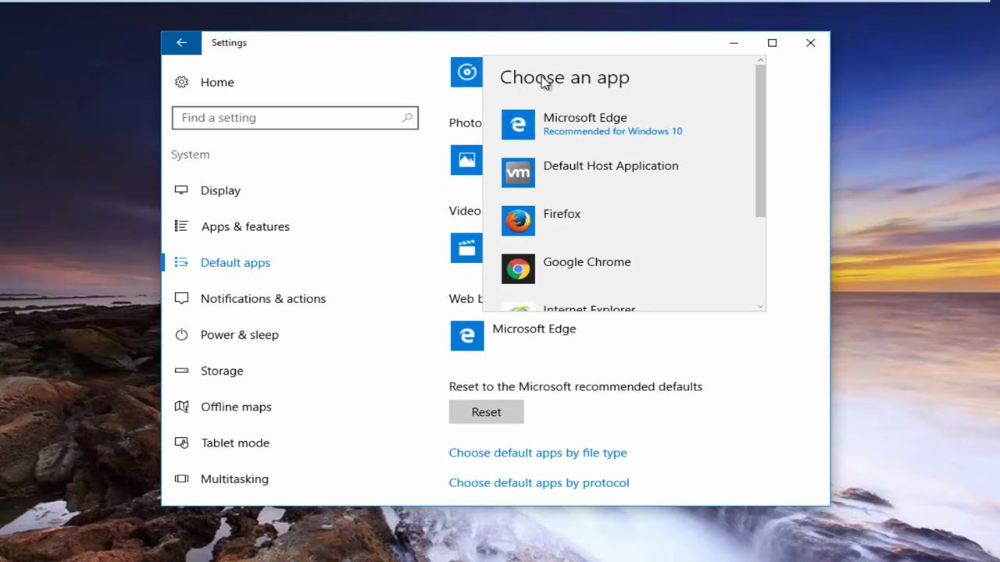
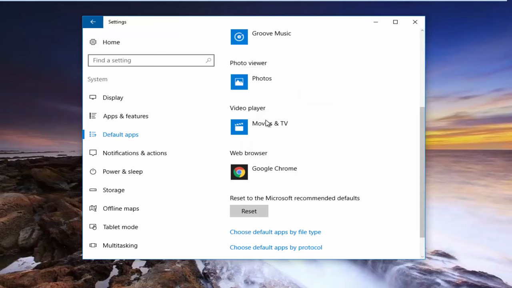

# Set Chrome as Default Browser

1. Click the Start menu (Windows icon) in the bottom-left corner of your screen.

   

2. Click the gear icon on the left side of the Start menu to open Settings.

   

3. Click on the 'System' tile (the first tile listed on the Settings home page).

   

4. In the left sidebar, click on 'Default apps' (the third option down).

   

5. Scroll down on the right side of the page to the 'Web browser' section and click on the currently set browser.

   

6. In the 'Choose an app' popup, select 'Google Chrome'. Note: Chrome must be installed on your computer first.

   

7. If prompted by Windows to reconsider, click 'Switch anyway' to confirm Chrome as your default browser.
8. Verify that the Web browser section now shows Google Chrome, then close the Settings window.

   
