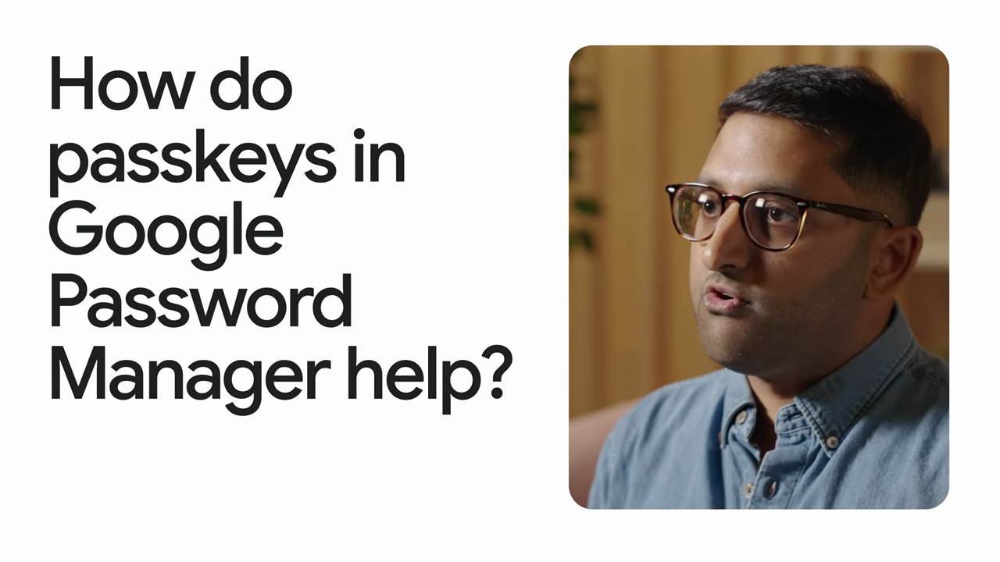
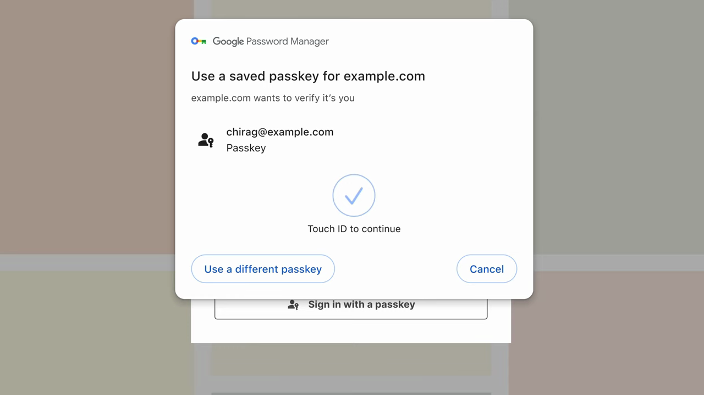
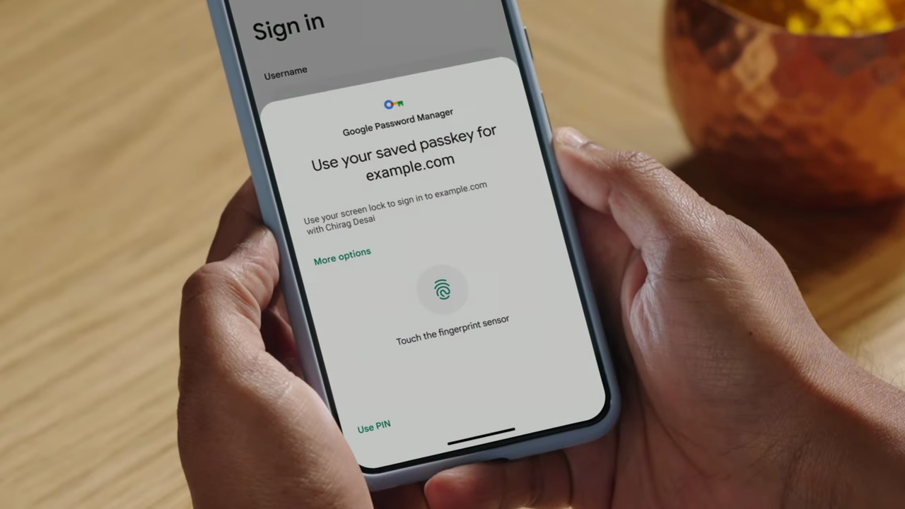

# Use Chrome Password Manager

1. Open Chrome and navigate to chrome://password-manager/passwords to open Google Password Manager.

   

2. Chrome will prompt you to save a password when you log into a website — click 'Save' in the popup to store your credentials.

   

3. To view saved passwords, go to chrome://password-manager/passwords and click on any listed account to reveal its details.

   

4. Click the eye icon next to a password field and verify your identity (e.g. device PIN or fingerprint) to reveal the stored password.

   

5. To edit a saved password, open the entry and click 'Edit', update the username or password fields, then click 'Save'.

   

6. To delete a saved password, open the entry and click the delete (trash) icon, then confirm removal.

   

7. To check for compromised passwords, go to chrome://password-manager/checkup — Chrome will flag weak, reused, or leaked passwords.

   

8. For stronger security, consider using passkeys where supported — Chrome and Google Password Manager will store and sync passkeys across your devices automatically.
