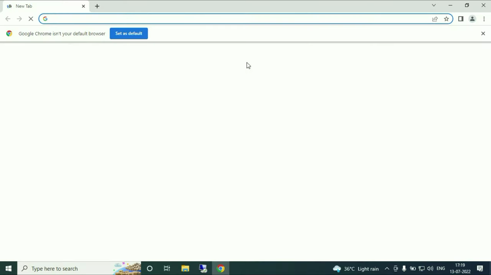
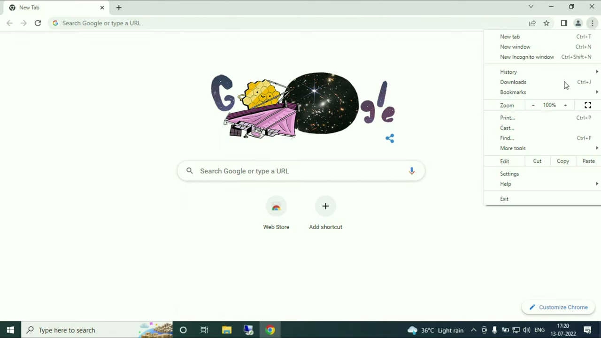
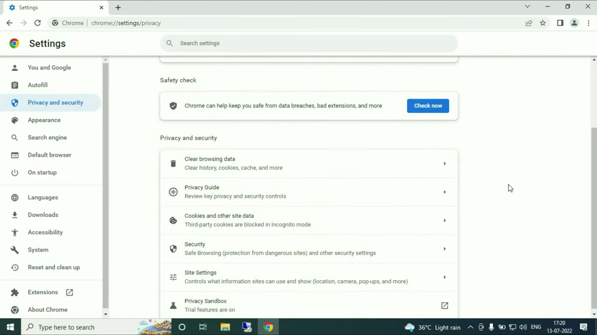
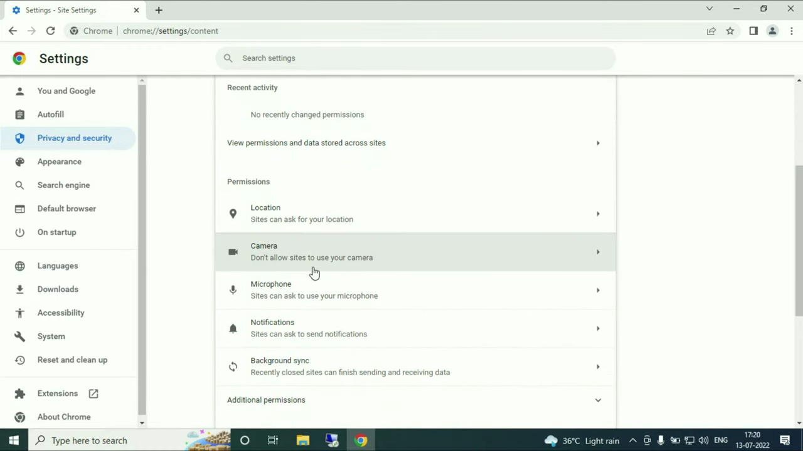
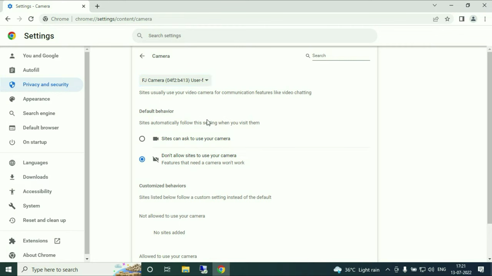
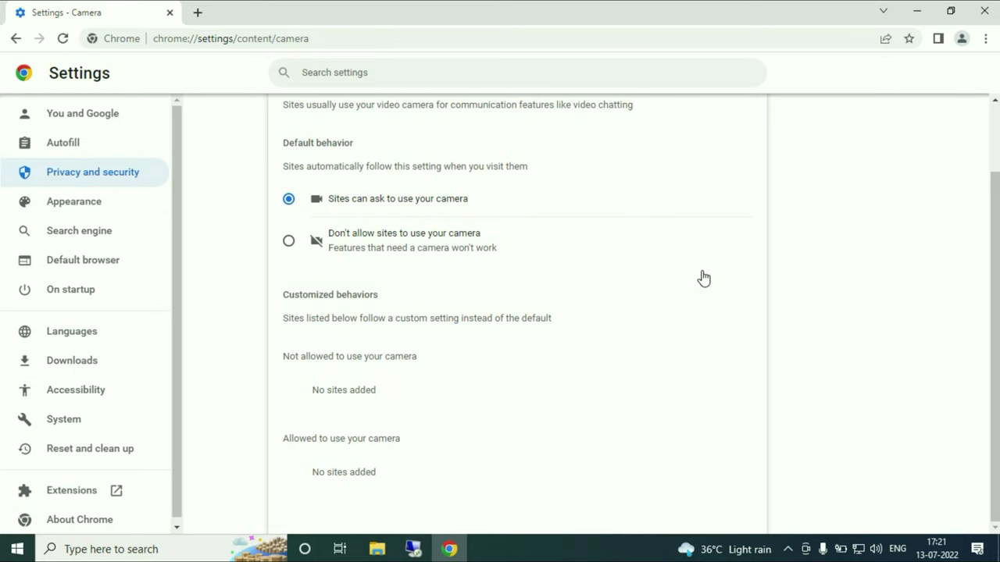

# Manage Site Permissions

1. Open Chrome and click the three-dot menu in the top-right corner, then select 'Settings'.

   

2. In the left sidebar, click 'Privacy and security'.

   

3. Scroll down and click 'Site settings' (also accessible via chrome://settings/content).

   

4. Click 'Camera' under the Permissions section to manage camera access.

   

5. Ensure 'Sites can ask to use your camera' is selected to allow per-site prompts, and confirm the correct camera device is selected in the dropdown.

   

6. Scroll down to review the 'Allowed' and 'Not allowed' site lists. To change a site's permission, click the arrow next to its URL and update the setting.

   

7. Return to 'Site settings' (chrome://settings/content) to manage other permissions such as microphone, location, and notifications using the same steps.
