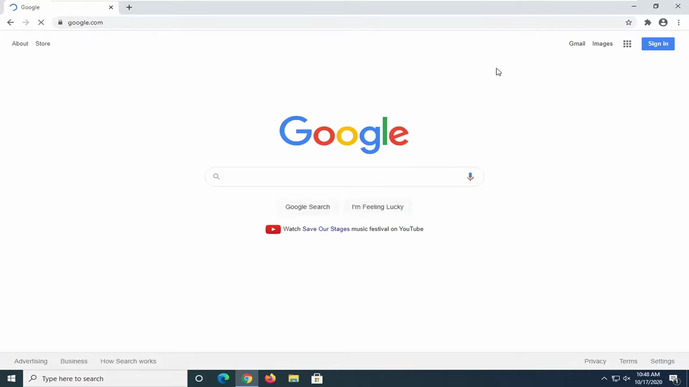
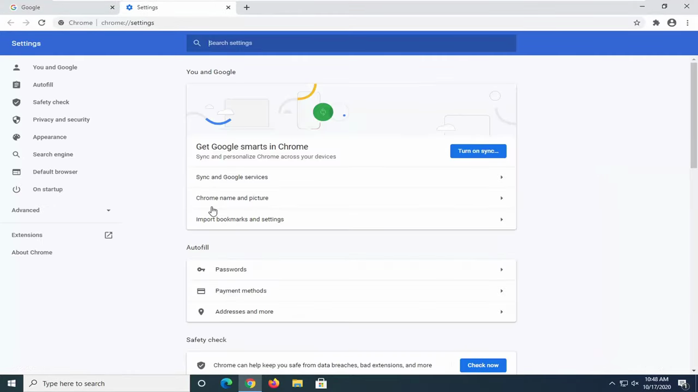
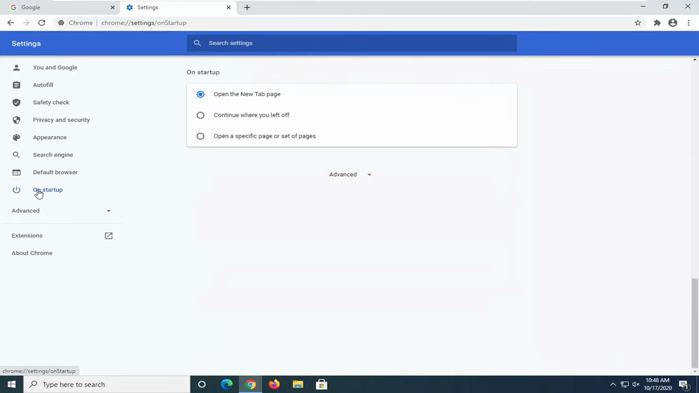
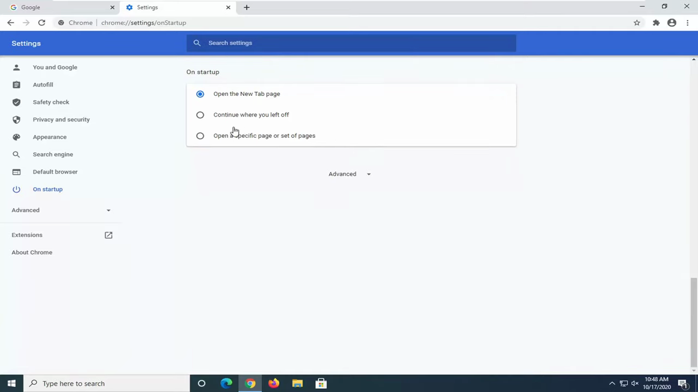
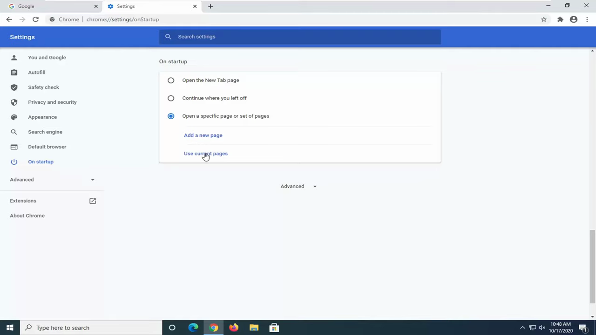
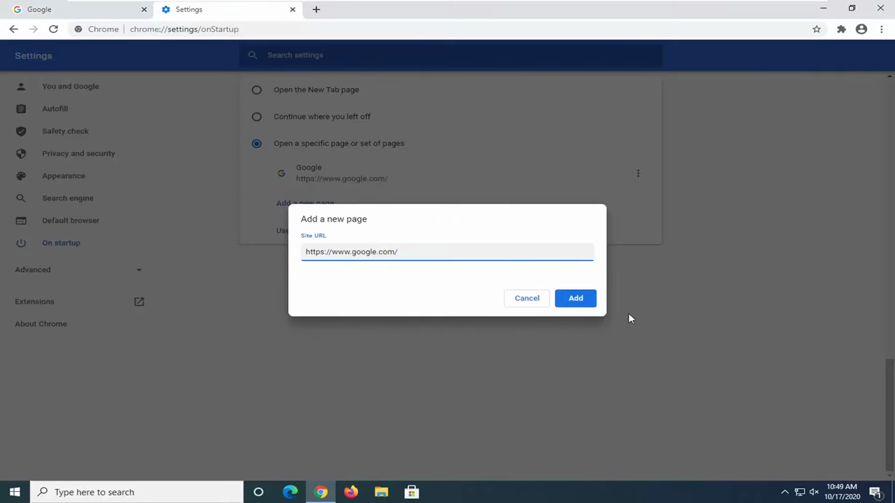

# Configure Startup Pages

1. Open Chrome and click the three-dot menu icon (⋮) in the top-right corner of the browser.

   

2. Select 'Settings' from the dropdown menu.

   

3. In the left sidebar, click 'On startup'. Alternatively, navigate directly to chrome://settings/onStartup.

   

4. Choose your preferred startup behavior: 'Open the New Tab page', 'Continue where you left off' (restores previous tabs), or 'Open a specific page or set of pages'.

   

5. If you selected 'Open a specific page or set of pages', click 'Use current pages' to add the currently open tab(s) as your startup pages.

   

6. Alternatively, click 'Add a new page', paste the desired URL into the input field, and click 'Add'.

   

7. Your startup pages are now saved. Chrome will open these pages automatically the next time it launches.
