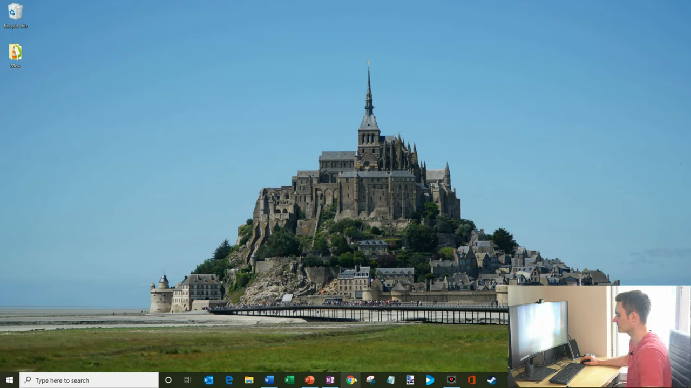
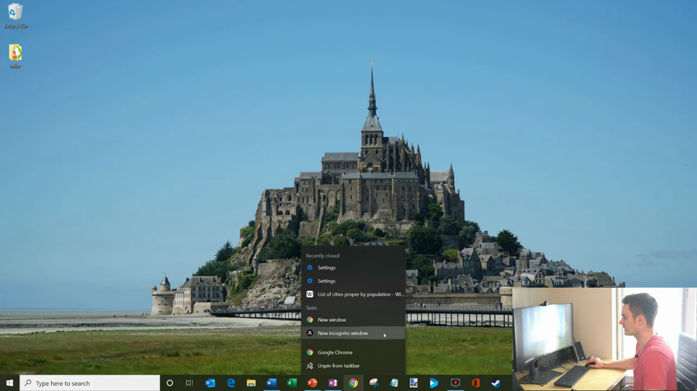
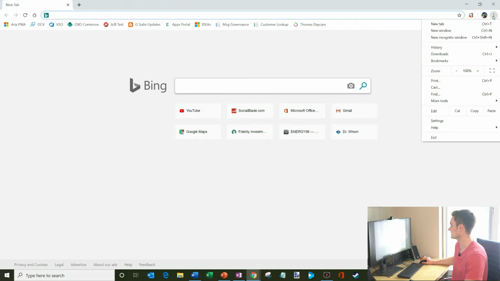
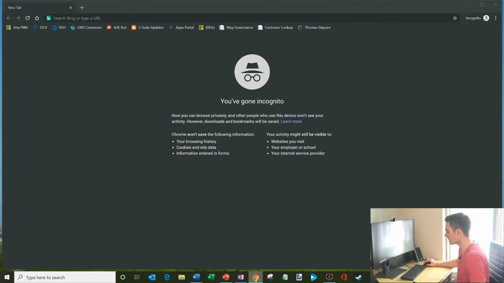
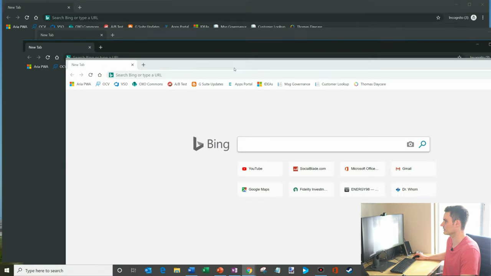

# Open Incognito Window

1. Right-click the Chrome icon in your taskbar to open a context menu

   

2. Click 'New Incognito Window' from the context menu

   

3. Alternatively, open Chrome and click the three-dot menu (⋮) in the top-right corner, then select 'New Incognito Window'

   

4. Or use the keyboard shortcut Ctrl+Shift+N (Windows/Linux) or Cmd+Shift+N (Mac) to open an Incognito window instantly
5. The Incognito window opens with a dark theme and a spy-hat icon — this dark border indicates you are in private browsing mode

   

6. Review the on-screen information: Chrome won't save your browsing history, cookies, or form data during this session

   
