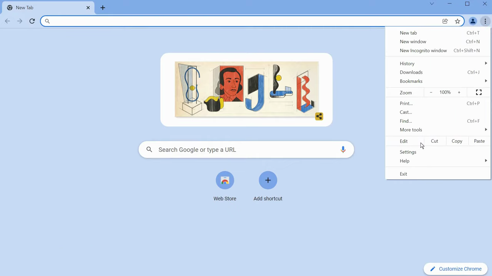
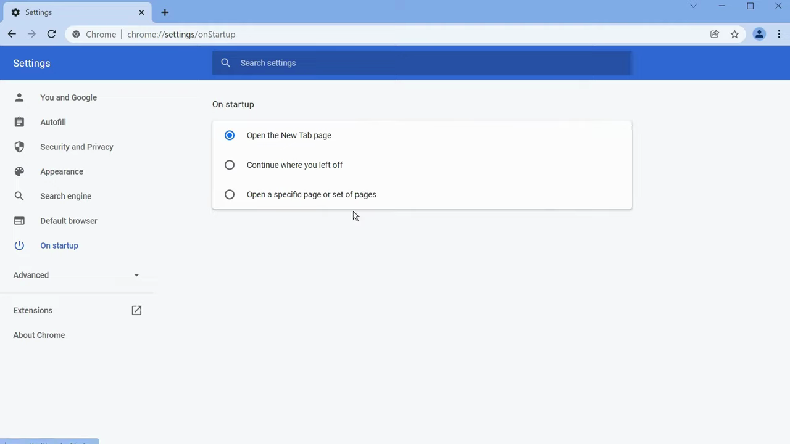
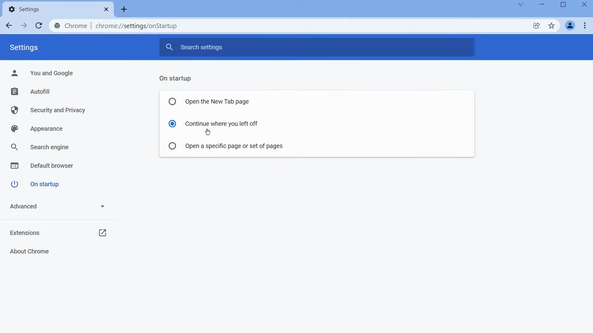
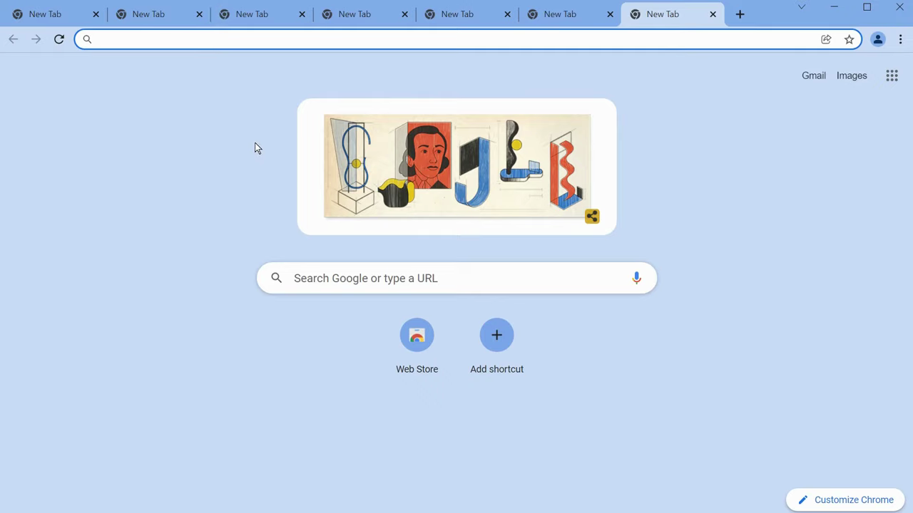

# Open and Close Tabs

1. Open a new tab in Chrome by pressing Ctrl+T (Windows/Linux) or Cmd+T (Mac), or by clicking the '+' button next to your existing tabs.
2. Close any individual tab by clicking the 'X' on the tab, or by pressing Ctrl+W (Windows/Linux) or Cmd+W (Mac).
3. To reopen tabs automatically on startup, click the three-dot menu in the top-right corner of Chrome and select 'Settings'.

   

4. In the Settings sidebar, click 'On startup'.

   

5. Select 'Continue where you left off' to restore all previously open tabs each time Chrome launches.

   

6. To reopen a single recently closed tab without changing startup settings, right-click any tab and choose 'Reopen closed tab', or press Ctrl+Shift+T (Windows/Linux) or Cmd+Shift+T (Mac).
7. Verify the setting works: open several tabs, close Chrome, then reopen it — all your previous tabs should be restored.

   
