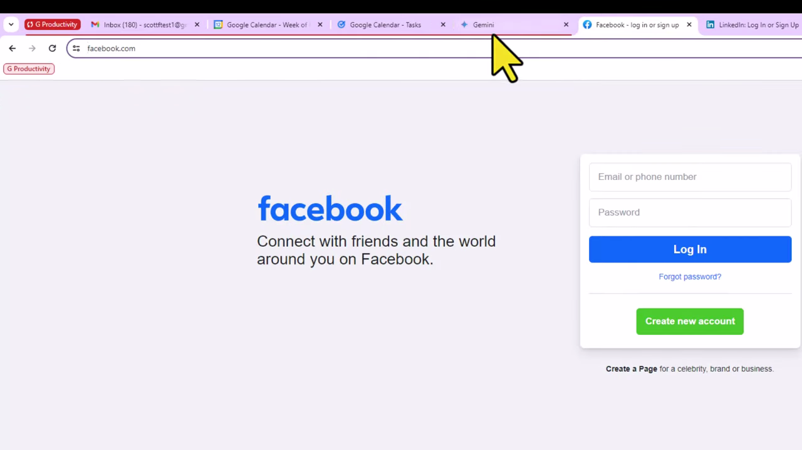
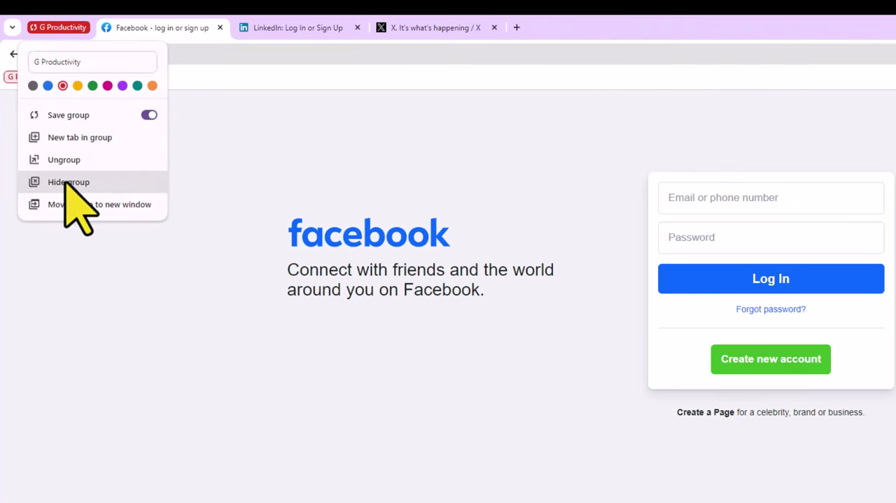
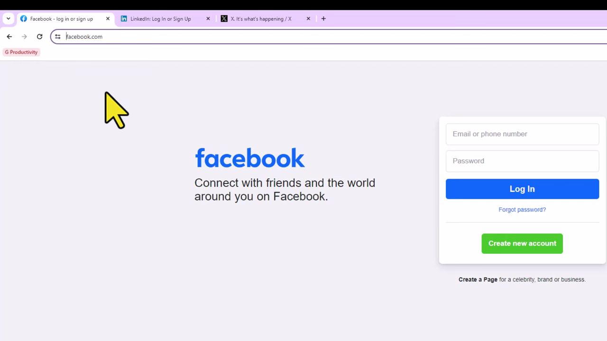
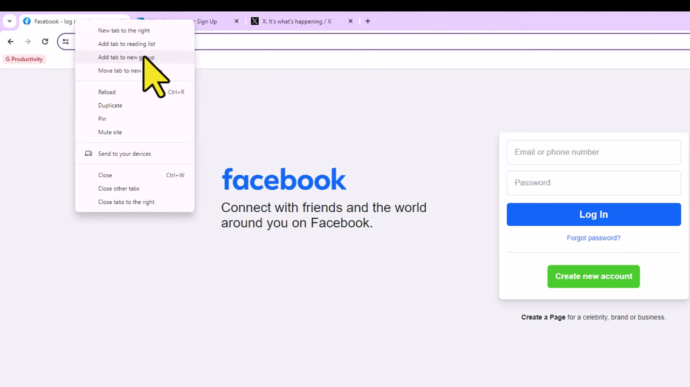

# Pin Tabs

1. Open Chrome and right-click on any tab you want to pin.

   

2. Select 'Pin tab' from the context menu. The tab will shrink to a small favicon-only tab on the left side of the tab bar.

   

3. Repeat for any other tabs you want to pin. Pinned tabs stay grouped on the left and persist when you reopen Chrome.

   

4. To reorder pinned tabs, click and drag them left or right within the pinned tab area.
5. To unpin a tab, right-click the pinned tab and select 'Unpin tab'. It will return to its full-size position in the tab bar.

   
