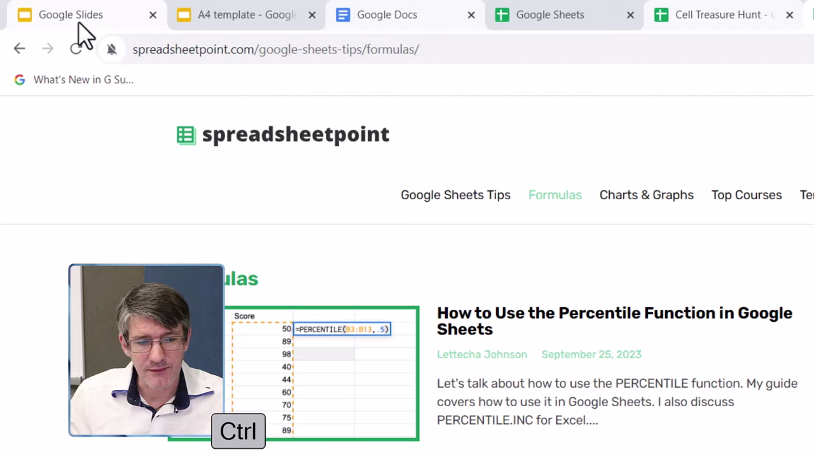
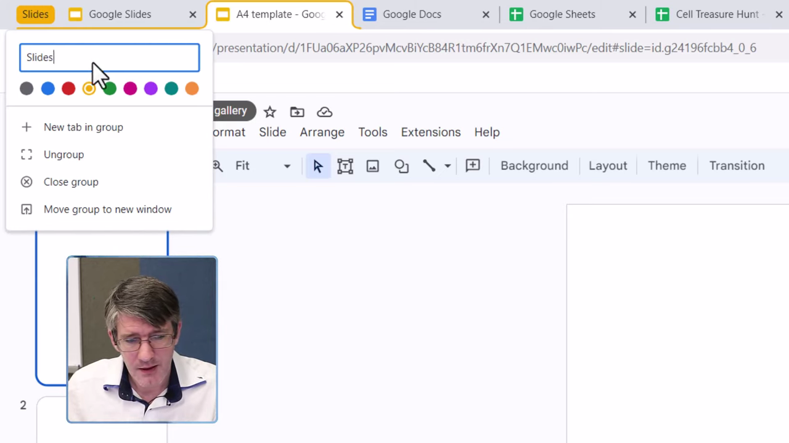
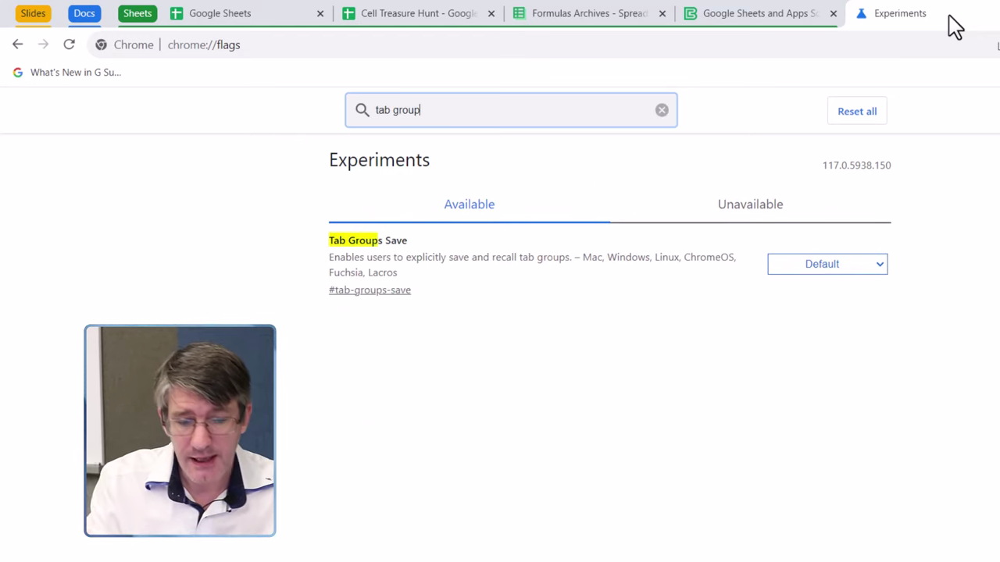
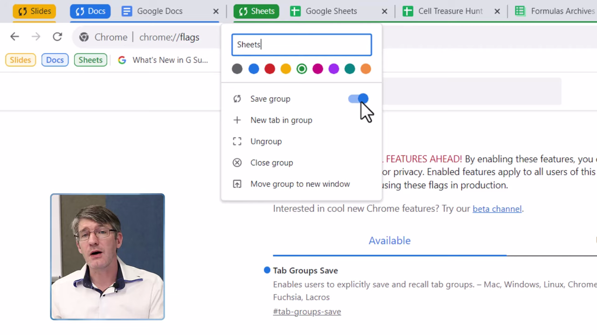

# Tab Groups

1. Open Chrome with multiple tabs you want to organize into groups.

   

2. Select multiple tabs to group: click the first tab, then hold Shift and click to select a range, or hold Ctrl (Cmd on Mac) and click to select individual tabs.

   

3. Right-click one of the selected tabs and choose 'Add tabs to new group' from the context menu.

   

4. Type a name for the group (e.g. 'Slides') and select a color to identify it visually.

   

5. The named, color-coded tab group now appears in the tab bar. Click the group label to collapse or expand its tabs.

   

6. To add more tabs to an existing group, right-click any tab and select 'Add tab to group', then choose the target group.

   

7. To rename or recolor a group, click its label to open the group editor bubble, then update the name or choose a new color.

   

8. To remove a tab from a group, right-click the tab and select 'Remove from group'. To delete the entire group, right-click the group label and select 'Ungroup' or 'Close group'.
