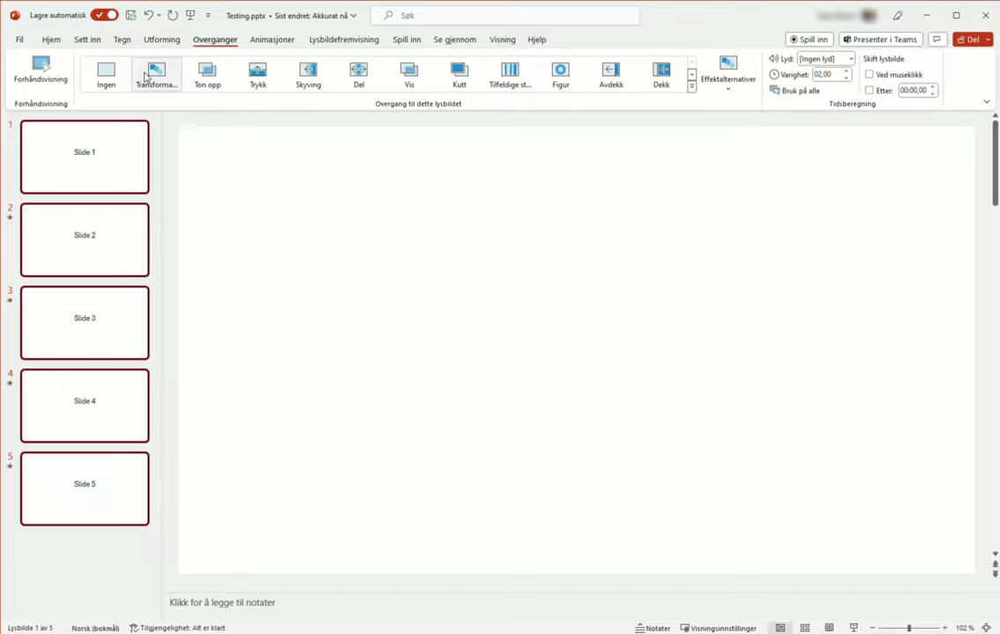
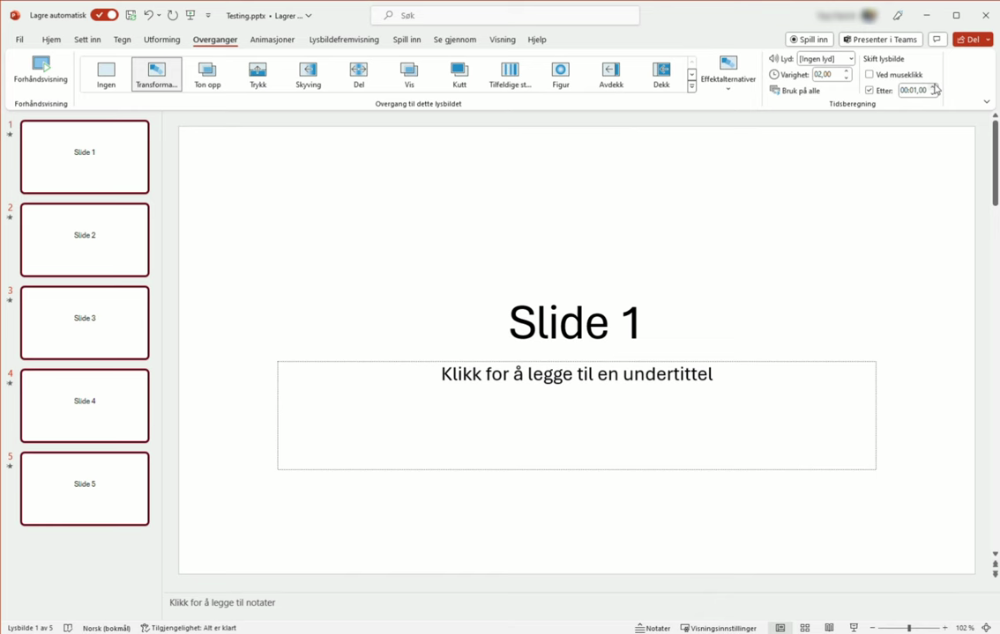

# Set Animation Timing and Order

1. Select all slides you want to include by clicking the first slide, then holding Shift and clicking the last slide in the slide panel.
2. Click the 'Transitions' tab in the menu bar to open the transitions panel.
3. Choose your desired transition effect from the transition gallery.
4. In the 'Timing' section on the far right of the Transitions panel, uncheck 'On Mouse Click' to disable manual advancement.

   

5. Check 'After' and enter the number of seconds each slide should display before automatically advancing (e.g., 1.00).

   

6. Run the slideshow to confirm each slide advances automatically after the specified duration.
