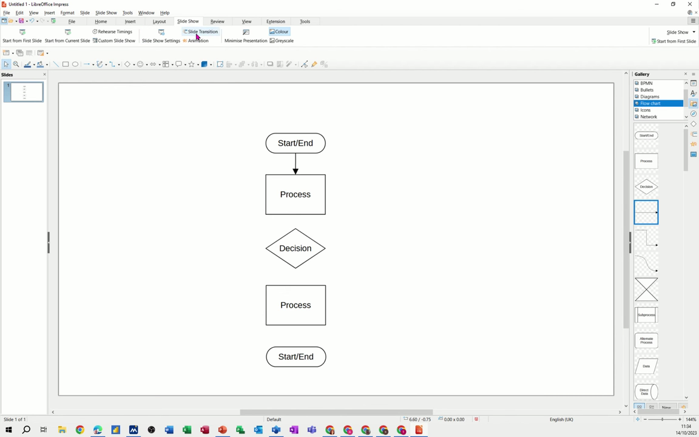
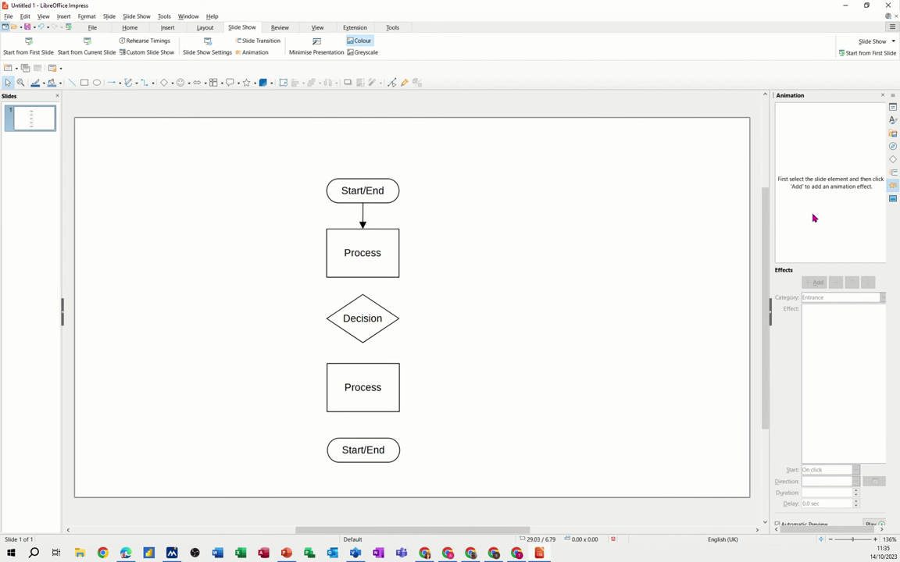
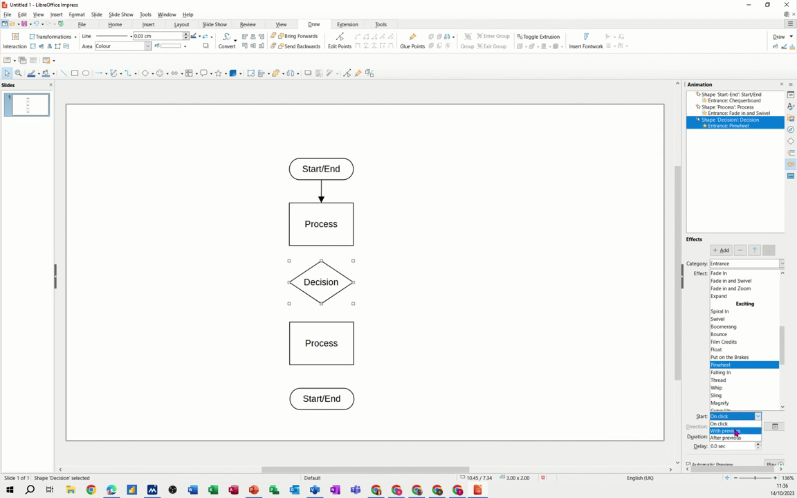

# Add Object Animations

1. Open the Animation panel by going to Slide Show > Animation in the menu bar.
2. Click on the object (text box, image, or shape) you want to animate to select it, then click the Add Effect button (the star/plus icon) in the Animation panel.

   

3. In the Add Animation dialog, choose the effect category from the Category dropdown: Entrance (object appears), Exit (object disappears), or Emphasis (object draws attention while visible).

   

4. Select an animation style from the list (e.g., Checkerboard, Fade and Swivel, or Pin Wheel). A preview plays automatically so you can see how it looks.
5. Set when the animation triggers using the Start dropdown at the bottom of the panel: On Click (manual advance), With Previous (plays simultaneously with the preceding animation), or After Previous (plays automatically after the preceding animation ends).

   

6. Repeat steps 2–5 for each additional object. Animations appear as a numbered list in the Animation panel, and will play in that order during the presentation.
