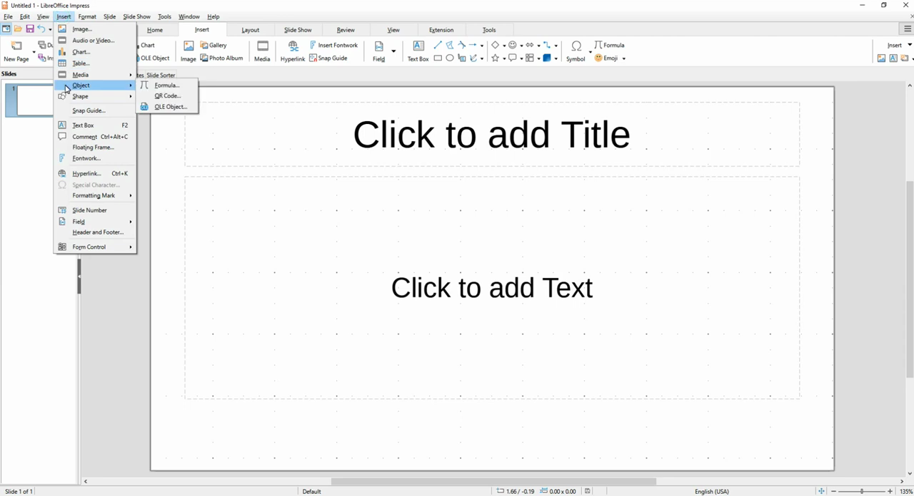
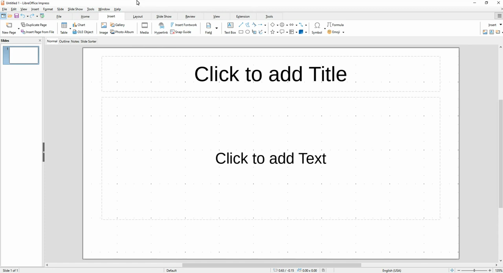

# Apply Master Slide

1. Open LibreOffice Impress with your presentation.
2. Click the View menu and select Master Slide to enter master slide editing mode.

   

3. In the Master Slides panel on the right, browse the available master slide themes.

   

4. Right-click the desired master slide thumbnail and select Apply to All Slides (or Apply to Selected Slides for selective application).
5. Click View > Normal to return to the normal editing view and confirm the theme has been applied.
