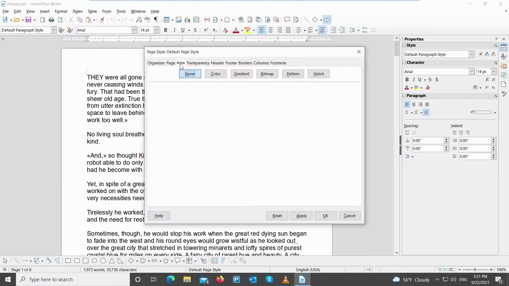
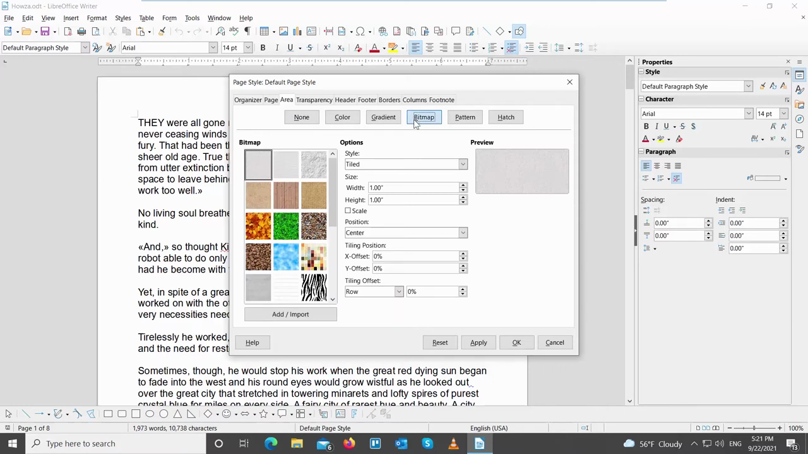
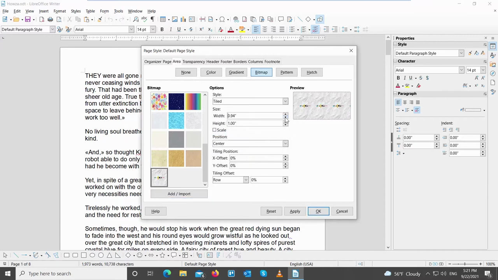

# Set Slide Background

1. Open your LibreOffice Impress presentation, then go to Slide menu > Slide Properties (or right-click a slide in the panel and select Slide Properties).
2. In the Slide Properties dialog, click the Background tab.

   

3. Select your background type from the buttons: Color (solid fill), Gradient, Bitmap (image/pattern), or Hatch.

   

4. For Color: pick a color from the list or color picker. For Gradient: choose a preset or configure start/end colors and angle. For Bitmap: select an existing pattern or click Add/Import to load an image file from disk.
5. If using a Bitmap image, adjust the size and position settings in the Size and Position sections as needed; a preview appears on the right.

   

6. Click OK. When prompted, choose whether to apply the background to all slides or only the current slide.
