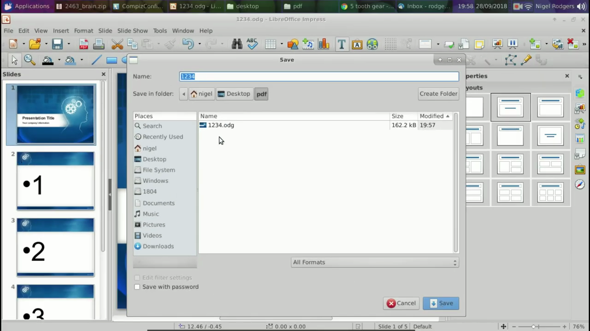
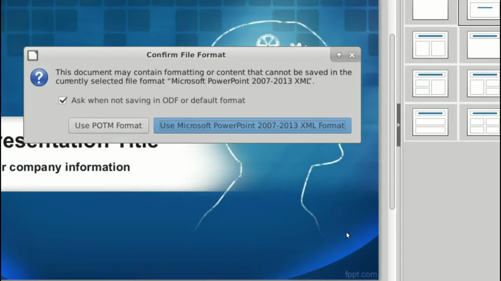

# Export to PDF

1. Open your presentation in LibreOffice Impress.
2. Click File > Export as PDF in the menu bar.

   

3. In the PDF Options dialog, configure quality settings such as image compression, page range, and general export options.

   

4. Click Export, choose a file name and destination in the save dialog, then click Save.
