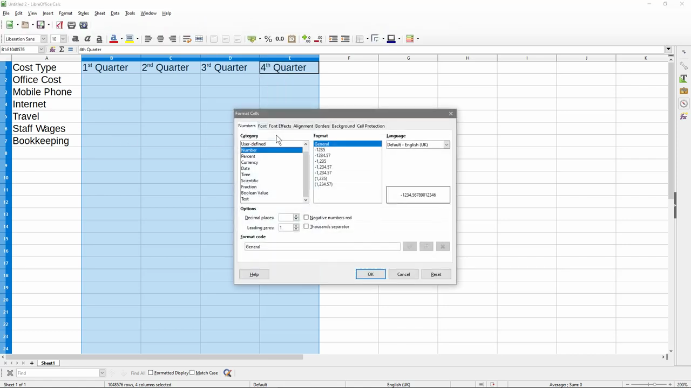

# Insert Charts and Graphs

1. Open LibreOffice Impress and navigate to Insert > Chart to insert a new chart object onto the slide.

   

2. In the Chart Wizard dialog that opens, select your chart type (Bar, Pie, Line, etc.) from the left panel and choose a subtype from the right.

   

3. Click 'Next' to proceed to the Data Range step, where you can enter or paste your data values directly into the chart data table.
4. Continue through the wizard steps to set data series labels and configure axes, then click 'Finish' to insert the chart.
5. Double-click the inserted chart to enter edit mode (a grey border appears), then right-click any chart element (bar, slice, line) and select 'Format Data Series' to change colors, borders, or transparency.

   

6. To change the chart type after insertion, right-click inside the chart and select 'Chart Type', then pick a new type and click OK.
7. Click outside the chart to deselect edit mode, then drag the chart to reposition it on the slide or drag its handles to resize it.
