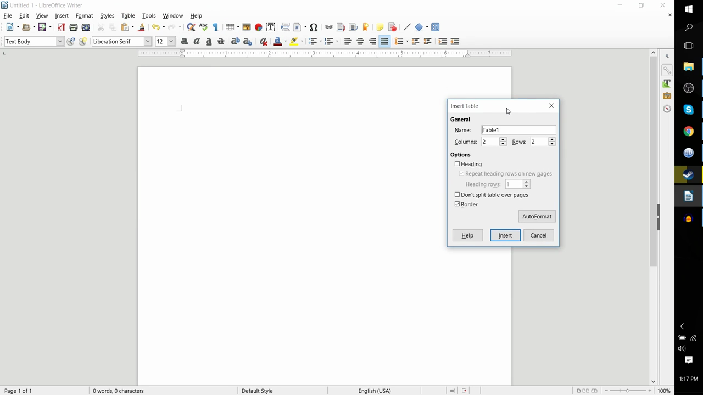
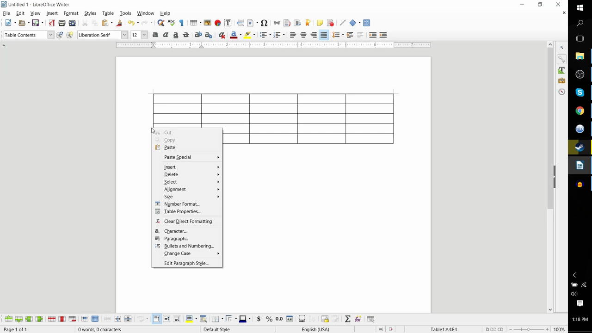
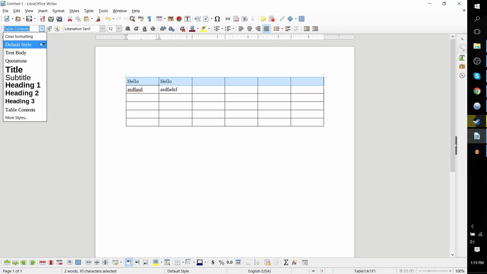

# Insert and Edit Tables

1. Go to Table > Insert Table (or press Ctrl+F12) to open the Insert Table dialog.
2. In the Insert Table dialog, set the number of columns (left-to-right) and rows (top-to-bottom), then click OK to insert the table.

   

3. To add a row, left-click on the far-left edge of a row to select it, then right-click and choose Insert > Rows Above or Rows Below.

   

4. To add a column, click the top edge of a column to select it, then right-click and choose Insert > Columns Left or Columns Right.
5. Click a cell and type to enter content. Use Tab to move to the next cell.
6. To format a row (e.g., as a header), click the far-left edge to select the entire row, then go to Table > Table Properties to change background color, borders, or text style.

   
