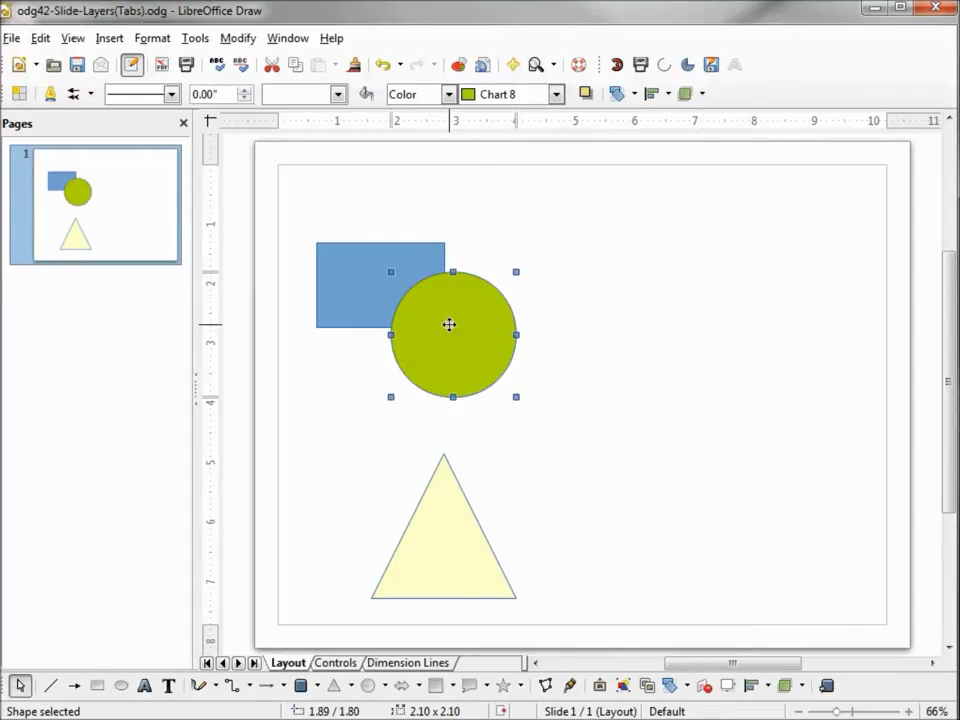
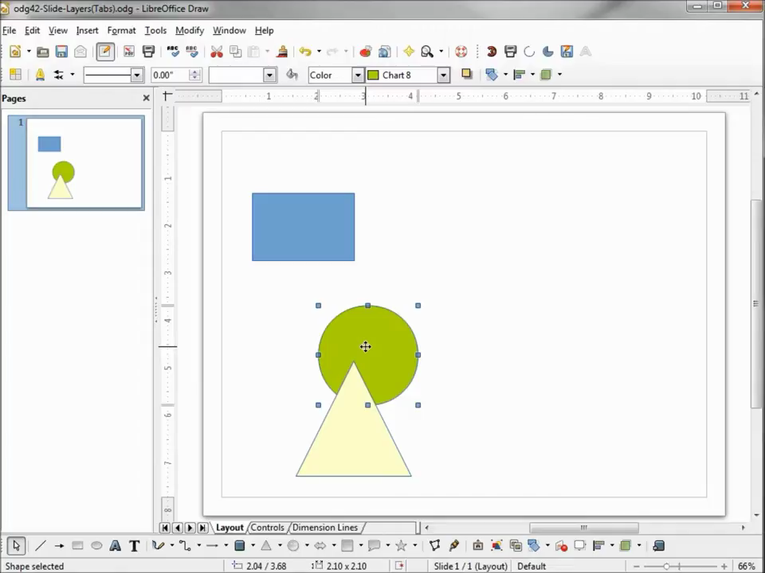

# Align and Distribute Objects

1. Add at least two or three shapes or objects to your slide.
2. Select all the objects you want to align: hold Shift and click each object, or press Ctrl+A to select all objects on the slide.
3. Open the alignment options via Format > Align Objects, then choose an alignment option: Left, Right, Centered (horizontal), Top, Bottom, or Middle (vertical).

   

4. To align objects relative to the slide boundaries instead of to each other, check the 'To Slide' option found in the Format > Align Objects submenu before selecting your alignment direction.

   

5. To evenly space three or more objects, select them all, then go to Format > Distribution. Choose 'Horizontally' to equalize horizontal gaps, or 'Vertically' to equalize vertical gaps, then click OK.

   

6. Click OK (or the alignment button) to apply. The selected objects will snap to the chosen alignment or spacing instantly.
