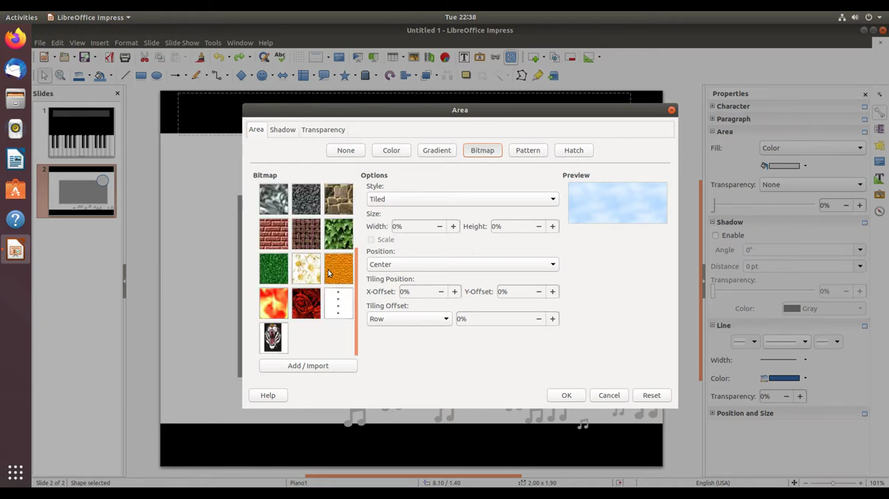

# Insert and Format Shapes

1. Open LibreOffice Impress and draw a shape using the Drawing toolbar at the bottom (e.g., select the rectangle or ellipse tool, then click and drag on the slide to create it).
2. Click the shape to select it, then right-click and choose 'Area...' from the context menu.

   

3. In the Area dialog, click the 'Bitmap' tab to use an image as the shape fill. To import a new image, click 'Add/Import' and browse to your file.

   

4. Select the desired bitmap from the list, then adjust the size percentage (e.g., 30%) and tiling/offset options as needed, then click OK.
5. To change the shape border (line), right-click the shape and choose 'Line...' to open the Line dialog, where you can set the color, width, and style of the border.
6. To insert an arrow, select the Lines and Arrows tool from the Drawing toolbar, choose an arrow style from the sub-menu, and drag to draw it on the slide.
