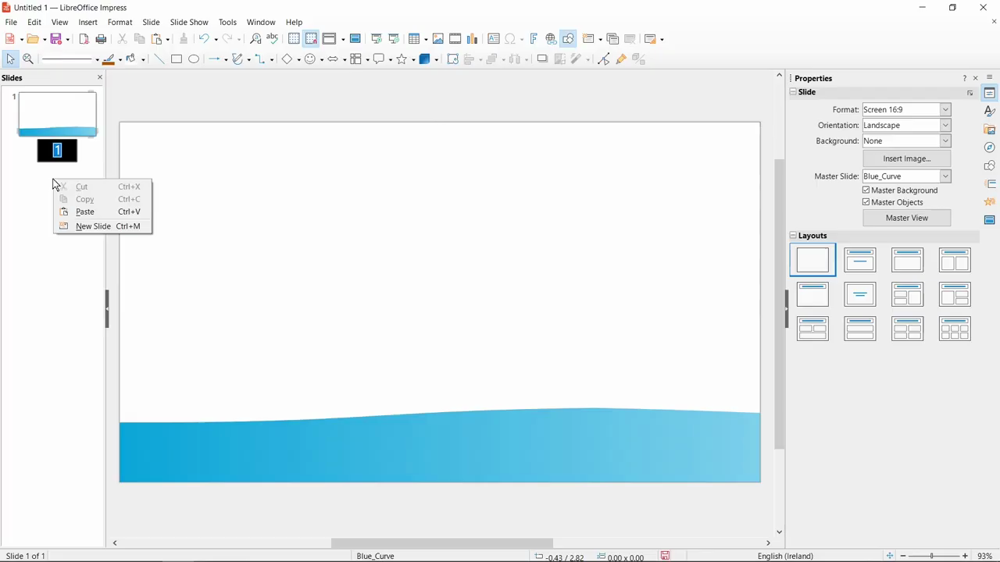
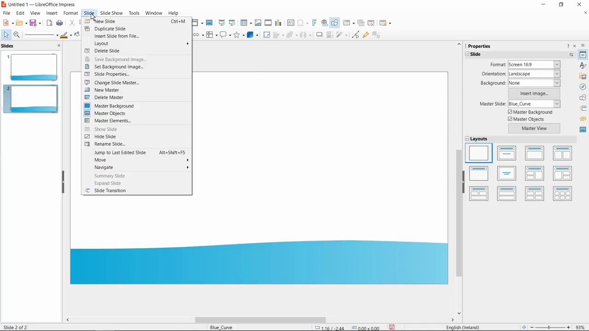

# Duplicate Slides

1. In the Slides panel on the left, right-click the slide you want to duplicate.
2. From the context menu, select 'Duplicate Slide'. A copy of the slide will be inserted immediately after the original.

   

3. Alternatively, select the slide(s) you want to duplicate, then go to Slide > Duplicate Slide in the menu bar.

   

4. To duplicate multiple slides at once, hold Ctrl and click each slide in the Slides panel before right-clicking and selecting 'Duplicate Slide'.
