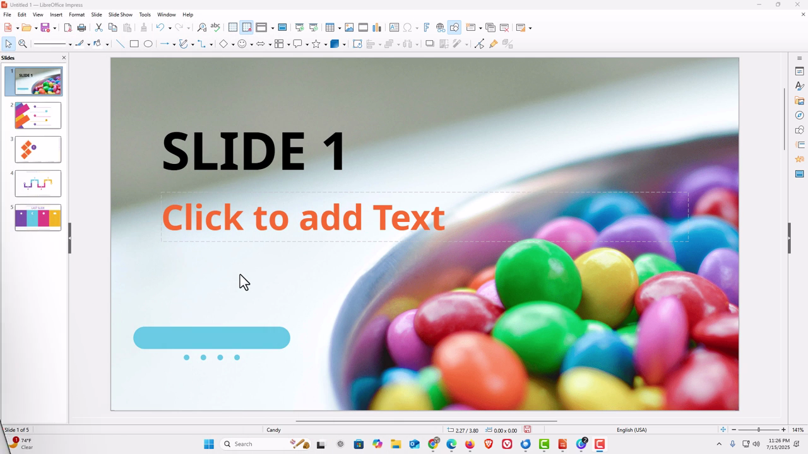

# Reorder Slides

1. Open your presentation in LibreOffice Impress. The Slides panel on the left shows all slides as thumbnails.
2. To reorder using drag-and-drop: click and hold a slide thumbnail in the Slides panel, then drag it up or down to the desired position and release.

   

3. To move a slide using the menu: right-click the slide thumbnail in the Slides panel, then select Move Slide > Move Slide Up or Move Slide Down.

   

4. To reorder slides in Slide Sorter view, go to View > Slide Sorter. This shows all slides in a grid, making it easier to drag and rearrange multiple slides at once.

   

5. In Slide Sorter view, click a slide to select it (or Ctrl+click to select multiple), then drag it to the new position.
6. Return to Normal view by going to View > Normal or double-clicking any slide in the sorter.
