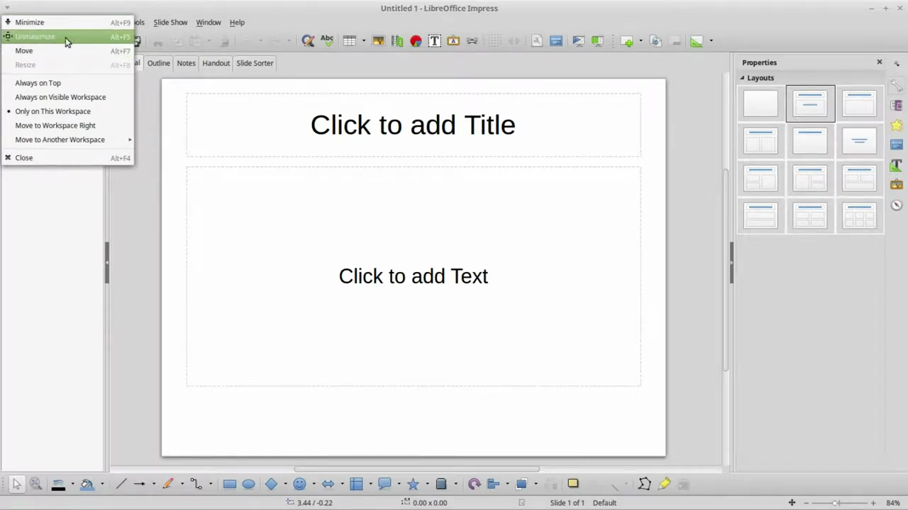
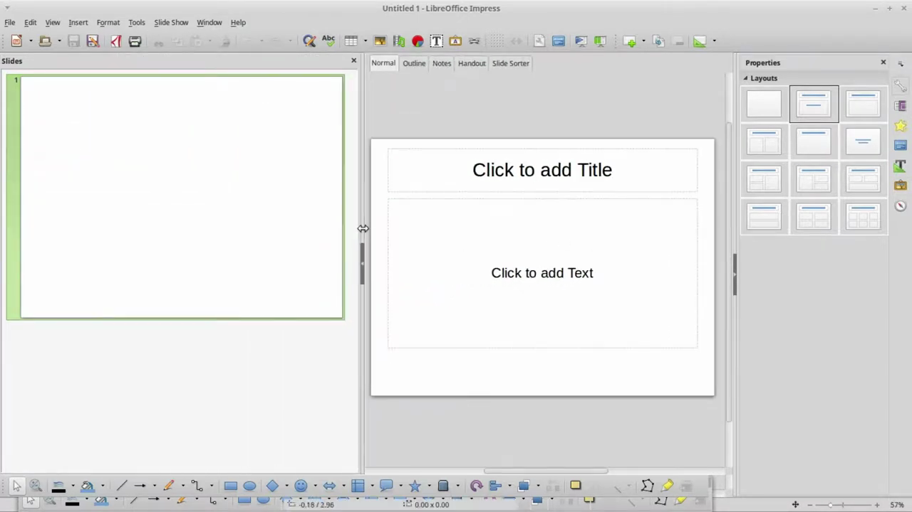

# Add Speaker Notes

1. Open your presentation in LibreOffice Impress and select the slide you want to add notes to from the Slides pane on the left.
2. Look for the Notes panel below the main slide editing area. If it is not visible, go to View > Notes to enable it.

   

3. Click inside the Notes panel where it says 'Click to add notes' and type your speaker notes for the current slide.
4. Format your notes text using the toolbar options (bold, italic, bullet points) as needed for readability during your presentation.
5. To review all notes at once, go to View > Notes Page, which shows each slide alongside its full notes page.

   

6. When presenting, start the slideshow via Slide Show > Start from First Slide (F5), then use Presenter Console (enabled via Slide Show > Presenter Console) to see your notes while the audience sees only the slides.
