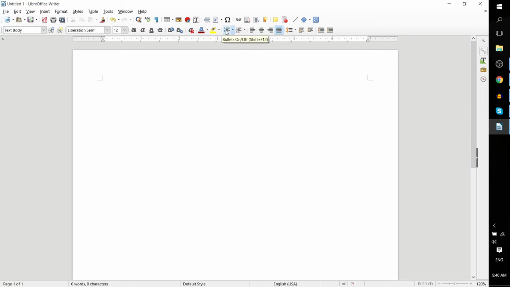
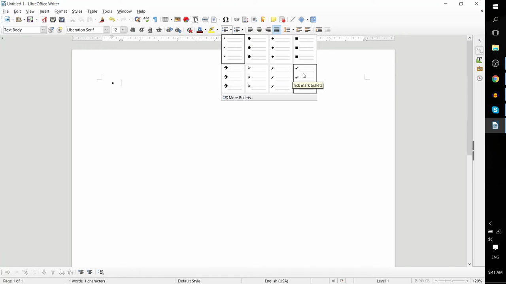
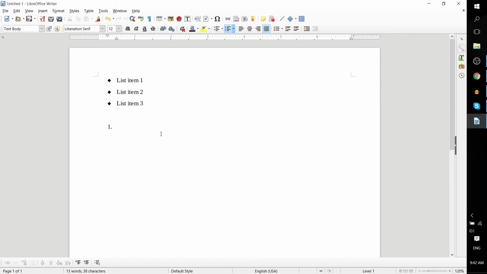

# Bullet and Numbered Lists

1. Place your cursor where you want the list to begin in your document.
2. In the formatting toolbar, click the 'Bullets On/Off' button to start a bullet list, or click 'Numbering On/Off' for a numbered list. Alternatively, use keyboard shortcuts: F12 for a numbered list, or Shift+F12 for a bulleted list.

   

3. To change the bullet style, click the dropdown arrow next to the 'Bullets On/Off' button and select a style from the gallery. Click 'More Bullets...' for additional options.

   

4. Type your first list item, then press Enter to automatically create the next bullet or number. Repeat for each item.
5. To create a nested (sub-level) list item, press Tab at the beginning of a new line to indent it one level deeper. Press Shift+Tab to move it back up a level.

   

6. To end the list and return to normal paragraph text, press Enter on an empty list line (with no text typed), and the list formatting will be removed.
