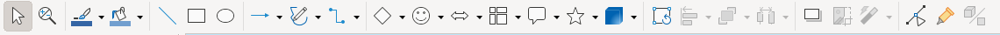

# Drawing Toolbar

The second icon row provides drawing tools, shape insertion, colour pickers, object arrangement, and editing mode toggles.

## Screenshot

## Elements (left → right)

**Selection & Navigation**:
- **Select** — pointer/selection mode
- **Zoom & Pan** — click to zoom in, Ctrl+click to zoom out, Shift+click to pan

**Colour Pickers**:
- **Line Color** (swatch + dropdown arrow) — applies/changes line/border colour
- **Fill Color** (swatch + dropdown arrow) — applies/changes fill colour

**Drawing Tools** (double-click any to lock mode for multiple draws):
- **Insert Line** — straight line
- **Rectangle** (Shift = square)
- **Ellipse** (Shift = circle)
- **Lines and Arrows** (+ dropdown with ~12 arrow/line variants)
- **Curves and Polygons** — freehand curves

**Shape Palettes** (each has dropdown arrow for full picker):
- **Connectors** — lines that snap to shape glue points
- **Basic Shapes** — rectangle, triangle, trapezoid, rhombus, etc.
- **Symbol Shapes** — hearts, smiley faces, music notes, etc.
- **Block Arrows** — filled directional arrows
- **Flowchart** — process, decision, terminator symbols
- **Callout Shapes** — speech bubbles with tails
- **Stars and Banners** — decorative star/scroll shapes
- **3D Objects** (+ dropdown) — cube, sphere, cylinder, cone, etc.

**Editing & Effects**:
- **Rotate** — toggle rotation handles on selected object
- **Align Objects** — left/center/right/top/middle/bottom alignment
- **Arrange** — z-order (Bring to Front, Send to Back, etc.)
- **Distribute Objects** — even spacing (requires 3+ objects)
- **Shadow** (toggle) — drop shadow effect
- **Crop Image** — cropping handles on images
- **Filter** — image filter/effects
- **Toggle Point Edit Mode** (F8) — Bézier node editing
- **Show Gluepoint Functions** — connector attachment points
- **Toggle Extrusion** — 3D depth effect on 2D shapes
