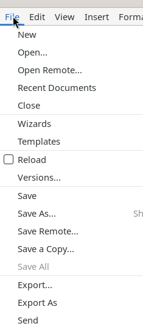
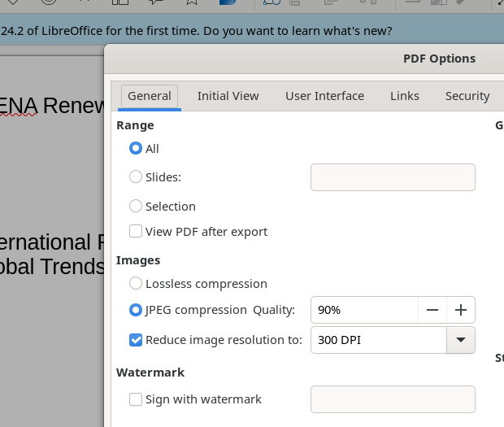
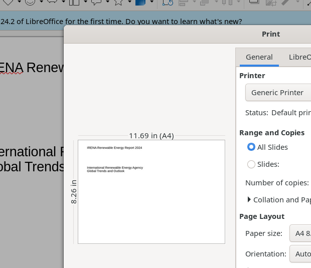

# File Menu

The File menu provides document lifecycle operations: creating, opening, saving, exporting, printing, and managing document properties and digital signatures.

## Screenshot

## Elements

- **New** → submenu: Text Document, Spreadsheet, Presentation (Ctrl+N), Drawing, Formula, Database, etc.
- **Open...** (Ctrl+O) — system file chooser
- **Open Remote...** — open from cloud/network storage
- **Recent Documents** → submenu of recently opened files + Clear List
- **Close** — closes current document
- **Wizards** → Letter, Fax, Agenda, Document Converter, Address Data Source
- **Templates** → Edit Template, Save as Template, Manage Templates (Shift+Ctrl+N)
- **Reload** — reverts to last saved version
- **Versions...** — manage saved document versions
- Common save actions: **Save** (Ctrl+S), **Save As...** (Shift+Ctrl+S), **Save Remote...**, **Save a Copy...**, **Save All**
- **Export...** — export via file chooser
- **Export As** → Export as PDF... (opens PDF Options dialog), Export Directly as PDF
- **Send** → Email Document, Email as PDF
- **Preview in Web Browser** — HTML preview
- **Print...** (Ctrl+P) — opens Print dialog
- **Printer Settings...** — OS printer configuration
- **Properties...** — document metadata (5-tab dialog)
- **Digital Signatures** → Digital Signatures..., Sign Existing PDF...
- **Exit LibreOffice** (Ctrl+Q)

## Key Dialogs

### PDF Options

Six tabs: **General**, Initial View, User Interface, Links, Security, Digital Signatures.

General tab controls:
- **Range**: All / specific Slides / Selection
- **Images**: Lossless or JPEG compression (quality %), reduce resolution (DPI)
- **Watermark**: optional text watermark
- **General flags**: Hybrid PDF, Archival (PDF/A), Universal Accessibility (PDF/UA), Tagged PDF
- **Structure**: Export outlines, comments, notes pages, hidden pages

### Print

Two tabs: **General**, **LibreOffice Impress**.

- **Printer** dropdown + Properties button
- **Range and Copies**: All Slides / Selection / specific slides; copy count
- **Page Layout**: Paper size, Orientation, Pages per Sheet
- **LibreOffice Impress tab**: Document type (Slides), content checkboxes (slide name, date/time, hidden pages), color mode (Original / Grayscale / B&W), size options
- Slide preview with page navigation

### Document Properties

Opened via **File > Properties...**. Five tabs: General, Description, Custom Properties, Security, Font. Shows filename, type, location, creation/modification dates, editing time, revision number. Includes Change Password and Digital Signatures buttons.
