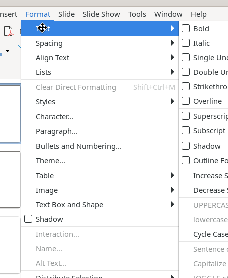
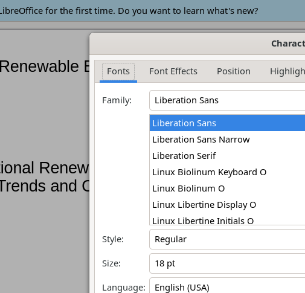
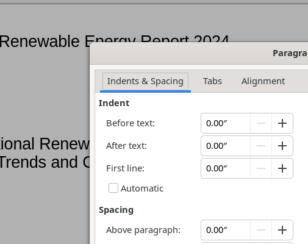

# Format Menu and Text Formatting Dialogs

The Format menu controls text styling, paragraph layout, object arrangement, and opens key formatting dialogs.

## Screenshot

## Elements

- **Text** → Bold (Ctrl+B), Italic (Ctrl+I), Single/Double Underline, Strikethrough, Overline, Superscript (Shift+Ctrl+P), Subscript (Shift+Ctrl+B), Shadow, Outline Font Effect, Increase/Decrease Size (Ctrl+]/[), case transforms (UPPERCASE, lowercase, Cycle Case, Sentence case, Capitalize Every Word, tOGGLE cASE, Small capitals)
- **Spacing** → Line Spacing 1/1.5/2 (Ctrl+1/5/2), Increase/Decrease Paragraph Spacing, Increase/Decrease Indent
- **Align Text** → Left (Ctrl+L), Center (Ctrl+E), Right (Ctrl+R), Justified (Ctrl+J); vertical: Top, Center, Bottom
- **Lists** → Unordered List, Ordered List, Demote/Promote (Shift+Alt+Right/Left), Move Down/Up (Shift+Alt+Down/Up)
- **Clear Direct Formatting** (Shift+Ctrl+M)
- **Styles** → Edit Style (Alt+P), Update Selected Style, New Style from Selection, Manage Styles (F11)
- **Character...** — opens Character dialog
- **Paragraph...** — opens Paragraph dialog
- **Bullets and Numbering...** — opens Bullets dialog
- **Theme...** — slide theme/color-scheme manager
- **Table** → row/column operations, Merge Cells, Split Cells, Properties
- **Image**, **Text Box and Shape** — context-dependent submenus
- **Shadow** (toggle), Interaction..., Name..., Alt Text... (object-dependent)
- **Distribute Selection** → horizontal/vertical distribution
- **Rotate**, **Flip** → orientation commands
- **Convert** → shape conversion options
- **Align Objects** → Left, Center, Right, Top, Middle, Bottom
- **Arrange** → Bring to Front (Shift+Ctrl++), Bring Forward (Ctrl++), Send Backward (Ctrl+-), Send to Back (Shift+Ctrl+-), In Front of/Behind Object, Reverse
- **Group** → group/ungroup operations

## Key Dialogs

### Character Dialog

Four tabs: **Fonts**, Font Effects, Position, Highlighting.

- **Fonts**: Family list, Style dropdown, Size, Language, Features button, live preview
- **Font Effects**: Font Color + Transparency, Overlining, Strikethrough, Underlining (each with color), Case, Relief, Outline/Shadow toggles
- **Position**: Superscript/Subscript/Normal, Spacing (expanded/condensed), Pair kerning
- **Highlighting**: Background highlight color

### Paragraph Dialog

Three tabs: **Indents & Spacing**, Tabs, Alignment.

- **Indent**: Before text, After text, First line (+ Automatic checkbox)
- **Spacing**: Above/Below paragraph, "Do not add space between paragraphs of the same style"
- **Line Spacing**: Single / 1.5 / Double / Proportional / At least / Leading / Fixed
- Live paragraph preview on right

### Bullets and Numbering Dialog

Opened via **Format > Bullets and Numbering...**. Controls: Level list (1–10 + all), Properties (Type, Character, Color, Relative size), Position (Indent, Width, Alignment), Scope (Slide/Selection), Apply to Master button, live preview.
