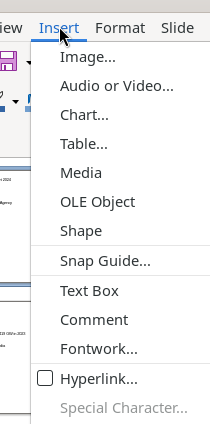

# Insert Menu

The Insert menu provides commands for adding content objects to slides: images, media, charts, tables, shapes, text elements, hyperlinks, fields, and form controls.

## Screenshot

## Elements

- **Image...** — file chooser with Preview and Link checkboxes
- **Audio or Video...** — media file chooser
- **Chart...** — inserts default column chart inline (OLE edit mode)
- **Table...** — dialog with column/row count spinners (default 5×2)
- **Media** → Gallery, Photo Album, Scan, Animated Image...
- **OLE Object** → Formula Object (Shift+Alt+E), QR and Barcode..., OLE Object...
- **Shape** → Line, Basic Shapes, Symbol Shapes, Block Arrows, Flowchart, Callout Shapes, Stars and Banners (each with flyout picker)
- **Snap Guide...** — positioning dialog
- **Text Box** (F2) — click-drag to create text frame
- **Comment** (Ctrl+Alt+C)
- **Fontwork...** — decorative text gallery
- **Hyperlink...** (Ctrl+K) — dialog with Internet/Mail/Document/New Document categories, URL + Text fields, Frame/Form settings
- **Special Character...** — character picker (requires active text cursor)
- **Formatting Mark** → No-break Space, Non-breaking Hyphen, Soft Hyphen, etc.
- **Slide Number** — inserts slide-number field
- **Field** → Date (fixed/variable), Time (fixed/variable), Author, Slide Number, Slide Title, Slide Count, File Name
- **Header and Footer...** — dialog with Slides and Notes/Handouts tabs; Date/Time, Footer, Slide Number toggles
- **Form Control** → 19 control types (Label, Text Box, Check Box, Option Button, List Box, Combo Box, Push Button, etc.)
