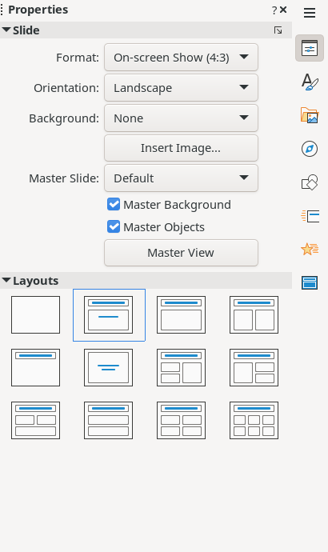
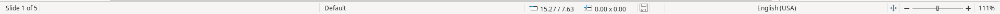

# Properties Panel, Sidebar Icons, and Status Bar

The right side of the window hosts the Properties panel and a vertical icon strip for switching sidebar views. The bottom status bar shows slide position, master name, coordinates, and zoom controls.

## Properties Panel

### Slide Section

- **Format** dropdown — slide size preset (On-screen Show 4:3, 16:9, Letter, A4, etc.)
- **Orientation** dropdown — Landscape / Portrait
- **Background** dropdown — None, Color, Gradient, Hatching, Bitmap, Pattern, Use Slide Background
- **Insert Image...** button — set background image
- **Master Slide** dropdown — select master template (e.g. "Default")
- **Master Background** ✓ — toggle master background visibility
- **Master Objects** ✓ — toggle master objects visibility
- **Master View** button — switch to Master Slide editing mode

### Layouts Grid

A 4×3 grid of 12 layout thumbnails. Click to apply a layout to the current slide. Includes: Blank, Title Slide, Title Only, Title/Content, and various multi-content arrangements.

## Sidebar Icon Strip

Vertical strip on the far-right edge. Each icon switches the sidebar panel:

| Icon | Panel | Shortcut |
|------|-------|----------|
| 1 | Properties | Alt+1 |
| 2 | Styles | Alt+2 |
| 3 | Gallery | Alt+3 |
| 4 | Navigator | Alt+4 |
| 5 | Shapes | Alt+5 |
| 6 | Slide Transition | Alt+6 |
| 7 | Animation | Alt+7 |
| 8 | Master Slides | Alt+8 |

## Status Bar

Elements (left → right):
- **Slide indicator** — "Slide 1 of 5" (read-only)
- **Slide Master name** — shows active master (e.g. "Default"); left-click opens Slide Design dialog, right-click lists available masters
- **Position readout** — cursor X/Y coordinates in document units
- **Size readout** — width × height of current selection
- **Document modification icon** — indicates unsaved changes
- **Fit slide to window** button
- **Zoom controls** — Zoom Out (−), slider, Zoom In (+)
- **Zoom percentage** — shows current zoom %; left-click opens Zoom dialog, right-click shows preset options
