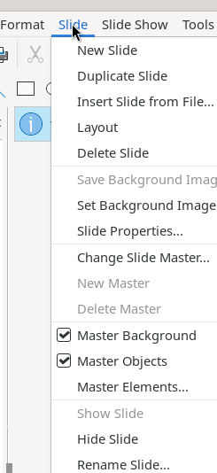
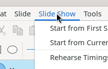
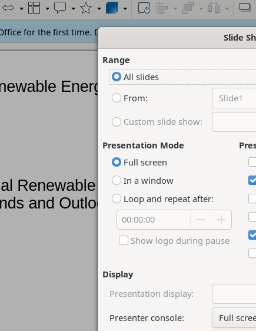

# Slide and Slide Show Menus

The Slide menu manages slide lifecycle, layout, master slides, and navigation. The Slide Show menu controls presentation playback.

## Slide Menu

### Slide management
- **New Slide** (Ctrl+M), **Duplicate Slide**, **Delete Slide**
- **Insert Slide from File...** → submenu
- **Layout** → 16 layout presets (Blank, Title Only, Title Slide, Title/Content, etc.)

### Properties and masters
- **Slide Properties...** — dialog with Slide, Background, Transparency tabs (format, dimensions, orientation, margins)
- **Set Background Image...** — file picker
- **Save Background Image...** (requires custom background)
- **Change Slide Master...** — master page selection dialog
- **Master Background** ✓ / **Master Objects** ✓ (toggles)
- **Master Elements...**, New Master, Delete Master (master view only)

### Visibility and navigation
- **Show Slide** / **Hide Slide** — toggle slide visibility in presentations
- **Rename Slide...** — name dialog
- **Jump to Last Edited Slide** (Shift+Alt+F5, toggle)
- **Move** → Slide to Start, Slide Up, Slide Down, Slide to End
- **Navigate** → To First/Previous/Next/Last Slide
- **Summary Slide** — inserts slide summarizing all titles
- **Expand Slide** (requires outline content)
- **Slide Transition** — opens Slide Transition panel in sidebar

## Slide Show Menu

- **Start from First Slide** (F5)
- **Start from Current Slide** (Shift+F5)
- **Rehearse Timings** — rehearsal mode recording per-slide timing
- **Custom Slide Show...** — create named slide subsets
- **Slide Show Settings...** — full configuration dialog

### Slide Show Settings Dialog

- **Range**: All slides / From specific slide / Custom slide show
- **Presentation Mode**: Full screen, In a window, Loop and repeat after time
- **Presentation Options**: Disable auto-change, Click background to advance, Mouse pointer visible/as pen, Enable animated images, Keep always on top
- **Display**: Presentation display, Presenter console, Navigation bar, Button size
- **Remote control**: Enable remote control, Enable insecure WiFi, Download App link
