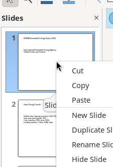

# Slides Panel and Canvas Area

The left Slides panel shows thumbnail previews for navigation and slide management. The central canvas is the main editing area for the active slide.

## Screenshot

## Slides Panel

The panel header shows "Slides" with an X button to close it (also toggled via View > Slide Pane).

**Slide thumbnails** are numbered 1–N. Interactions:
- **Left-click** — navigate to that slide
- **Right-click** — open context menu
- **Drag** — reorder slides

### Slide Thumbnail Context Menu

- Cut, Copy, Paste
- **New Slide**, **Duplicate Slide**
- **Rename Slide...** — opens name dialog
- **Hide Slide** (toggle) — hidden slides are greyed out and skipped in presentations
- **Delete Slide** — immediate deletion, no confirmation
- **Layout** → 16 layout presets
- **Navigate** → To Next Slide, To Last Slide
- **Move** → Slide Down, Slide to End
- **Slide Properties...** — opens Slide Properties dialog (Slide, Background, Transparency tabs)

## Canvas Area

The canvas displays the active slide at the current zoom level with optional rulers and grid overlay.

**Text placeholders**: Single-click selects (8 resize handles); double-click enters text editing mode. Right-click on a selected text frame opens a context menu with: Cut, Copy, Paste, Shrink text on overflow, Position and Size, Line, Area, Text Attributes, Character, Paragraph, Align Objects, Arrange, Convert, Clear Direct Formatting, Edit Style, Animation, Interaction.

**Empty canvas right-click** (on grey workspace outside slide): Paste, Rulers toggle, Grid and Helplines, Snap Guides, Insert Snap Guide, Layout, Navigate, Move, Change Slide Master, Slide Transition, Slide Properties.

**Scrollbars**: Horizontal (bottom) and vertical (right) scrollbars appear when zoomed in.
