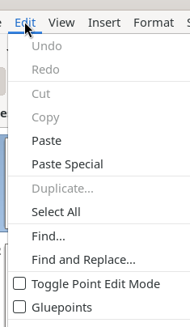
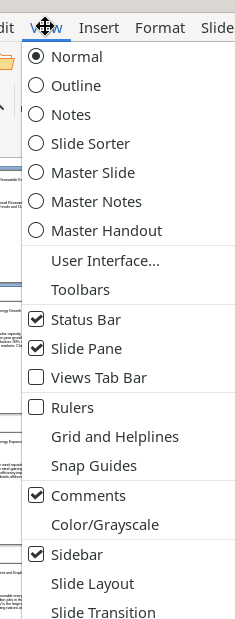

# Edit, View, Window, and Help Menus

Standard menus for editing operations, view configuration, window management, and help resources.

## Edit Menu

- **Undo** (Ctrl+Z) / **Redo** (Ctrl+Y)
- **Cut** (Ctrl+X), **Copy** (Ctrl+C), **Paste** (Ctrl+V)
- **Paste Special** → Paste Unformatted Text (Shift+Ctrl+Alt+V), Paste Special... (Shift+Ctrl+V)
- **Duplicate...** (Shift+F3), **Select All** (Ctrl+A)
- **Find...** (Ctrl+F) — inline Find toolbar at bottom of window
- **Find and Replace...** (Ctrl+H) — full dialog with Match case, Whole words, Similarity search, Replace All
- **Toggle Point Edit Mode** (F8) — Bézier point editing
- **Gluepoints** — connector attachment points
- Hyperlink, Fields, External Links (context-dependent, may be greyed)
- **OLE Object** → context-dependent sub-commands
- **Edit Mode** (Shift+Ctrl+M) — toggle edit vs. read-only

## View Menu

**View modes** (radio group): Normal, Outline, Notes, Slide Sorter, Master Slide, Master Notes, Master Handout

**UI & Toolbars**:
- User Interface... — select UI layout (Standard, Tabbed, etc.)
- Toolbars → submenu of 30+ toggleable toolbars + Customize...

**Toggle switches**: Status Bar ✓, Slide Pane ✓, Views Tab Bar, Rulers (Shift+Ctrl+R), Comments ✓, Sidebar (Ctrl+F5), Navigator (Shift+Ctrl+F5), Color Bar

**Submenus**: Grid and Helplines (Display Grid, Grid to Front, Helplines While Moving), Snap Guides (7 snap-to toggles), Color/Grayscale (Color/Grayscale/B&W), Zoom (presets + Zoom dialog)

**Sidebar panels**: Slide Layout, Slide Transition, Animation, Styles (F11), Gallery

## Window Menu

- **New Window** — opens document in a second window
- **Close Window** (Ctrl+W)
- Active document list (radio selection)

## Help Menu

- **LibreOffice Help** (F1), What's This?, User Guides
- **Search Commands** (Shift+Escape) — inline command search bar
- Show Tip of the Day, Get Help Online, Send Feedback
- Restart in Safe Mode..., Get Involved, Donate, License Information
- **About LibreOffice** — version and build info
