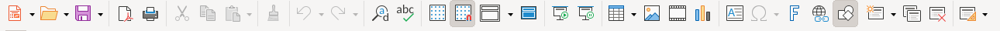

# Standard Toolbar

The first icon row below the menu bar provides quick access to file operations, clipboard actions, undo/redo, search, and grid controls.

## Screenshot

## Elements (left → right)

- **New** (Ctrl+N) — opens Select a Template dialog
- **Open** (Ctrl+O) — file-open dialog
- **Save** (Ctrl+S)
- **Export Directly as PDF** — one-click PDF export
- **Print** (Ctrl+P) — opens Print dialog
- | separator |
- **Cut** (Ctrl+X), **Copy** (Ctrl+C), **Paste** (Ctrl+V)
- **Clone Formatting** — single-click copies formatting; double-click locks mode for multiple targets
- | separator |
- **Undo** (Ctrl+Z), **Redo** (Ctrl+Y)
- | separator |
- **Find and Replace** (Ctrl+H) — opens Find & Replace dialog
- **Spelling** (F7) — runs spell-checker
- **Display Grid** (toggle) — grid overlay visibility
- **Snap to Grid** (toggle) — object snapping to grid
