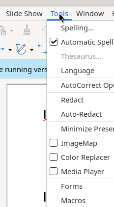

# Tools Menu

The Tools menu provides spelling, language, macro, customization, and application-wide settings.

## Screenshot

## Elements

- **Spelling...** (F7) — opens Spelling & Grammar dialog
- **Automatic Spell Checking** (Shift+F7) — toggle real-time spell-check underlines ✓
- **Thesaurus...** (Ctrl+F7) — requires active text selection
- **Language** → language selection submenu
- **AutoCorrect Options...** — autocorrect configuration dialog
- **Redact** / **Auto-Redact** — content redaction tools
- **Minimize Presentation...** — compress embedded media to reduce file size
- **ImageMap** (toggle), **Color Replacer** (toggle), **Media Player** (toggle)
- **Forms** → form control design submenu
- **Macros** → Run Macro..., Edit Macros..., Organize Macros, Digital Signature..., Organize Dialogs...
- **Development Tools** (toggle) — developer sidebar panel
- **XML Filter Settings...** — manage import/export XML filters
- **Extensions...** (Ctrl+Alt+E) — Extension Manager
- **Customize...** — dialog with 6 tabs: Menus, Toolbars, Notebookbar, Context Menus, Keyboard, Events
- **Options...** (Alt+F12) — application settings tree: LibreOffice (User Data, General, View, Print, Paths, Fonts, Security, Accessibility, Advanced), Load/Save, Languages, LibreOffice Impress, Charts, Internet
